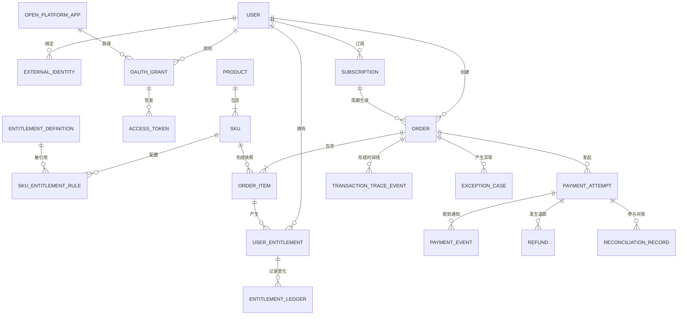

# 领域对象与关系字典

版本：V1.0  
状态：阶段 1 产品基线  
最后更新：2026-07-30

## 1. 文档目的

本字典统一产品、前端、后端、测试和运营对核心业务名词的理解。

它回答五类问题：

1. 系统里有哪些业务对象？
2. 每个对象代表什么事实，不能代表什么？
3. 谁创建和修改它？
4. 对象之间如何关联？
5. 哪些规则必须由接口、数据库和测试共同保证？

本文件描述业务模型，不等同于最终数据库表结构。后续研发可以根据性能、事务和扩展需要拆表，但不能改变这里定义的业务事实。

## 2. 建模原则

### 2.1 一个对象只描述一种事实

- 订单描述用户向商户购买什么。
- 支付单描述某一次向支付渠道付款的尝试。
- 支付事件描述渠道发来的一次通知。
- 权益描述用户最终获得什么服务。
- 退款单描述一笔资金退回请求。

不能用一个 `status` 同时表达购买、资金和权益结果。

### 2.2 历史交易必须可追溯

- 订单创建时保存商品名称、价格、币种和权益快照。
- 商品后来改价或下架，不改变历史订单。
- 支付回调、权益变化和退款操作保留流水，不直接覆盖历史事实。

### 2.3 外部编号和内部编号分离

- 内部主键用于系统关联。
- 业务编号用于客服、用户和运营查询。
- 渠道编号由微信、支付宝、Stripe 或模拟渠道生成。
- 渠道事件编号用于 Webhook 去重。

### 2.4 所有会重复到达的操作都要幂等

创建支付、处理 Webhook、发放权益、退款和权益回收均需要幂等键或唯一约束。

## 3. 领域对象总览

| 领域 | 中文对象 | 英文对象 | 主要用途 | 实现优先级 |
|---|---|---|---|---|
| 用户认证 | 用户 | `User` | 统一承载购买者和权益拥有者 | MVP-A |
| 用户认证 | 第三方身份 | `ExternalIdentity` | 关联微信、Google 等外部账号 | MVP-B |
| 开放平台 | 开放平台应用 | `OpenPlatformApp` | 代表一个接入方应用 | MVP-B |
| 开放平台 | 用户授权 | `OAuthGrant` | 记录用户授予应用的权限 | MVP-B |
| 开放平台 | 访问令牌 | `AccessToken` | 代表应用调用 API 的授权凭证 | MVP-B |
| 商品 | 产品 | `Product` | 用户可理解的售卖内容集合 | MVP-A |
| 商品 | SKU | `Sku` | 可下单、可定价的最小售卖单元 | MVP-A |
| 商品 | 权益定义 | `EntitlementDefinition` | 定义会员、额度或功能权益 | MVP-A |
| 商品 | SKU 权益规则 | `SkuEntitlementRule` | 定义买某 SKU 发放哪些权益 | MVP-A |
| 交易 | 业务订单 | `Order` | 记录一次购买意图与应付金额 | MVP-A |
| 交易 | 订单明细 | `OrderItem` | 保存购买 SKU 及交易快照 | MVP-A |
| 支付 | 支付尝试 | `PaymentAttempt` | 记录一次渠道付款尝试 | MVP-A |
| 支付 | 支付渠道事件 | `PaymentEvent` | 保存一次 Webhook 原始通知及处理结果 | MVP-A |
| 权益 | 用户权益 | `UserEntitlement` | 表示用户当前拥有的权益 | MVP-A |
| 权益 | 权益流水 | `EntitlementLedger` | 记录发放、消耗、回收和过期 | MVP-A |
| 订阅 | 订阅合约 | `Subscription` | 记录自动续费关系和周期 | MVP-B |
| 售后 | 退款单 | `Refund` | 记录一次退款申请及渠道结果 | MVP-A |
| 财务 | 对账记录 | `ReconciliationRecord` | 比较业务账、渠道账和退款账 | MVP-B |
| 可观测 | 交易时间线事件 | `TransactionTraceEvent` | 为观察台提供全链路解释 | MVP-A |
| 可观测 | 异常工单 | `ExceptionCase` | 承接自动恢复失败后的人工闭环 | MVP-A |

`MVP-A` 是面试主链路必须实现；`MVP-B` 是完成主链路后按时间补齐。

## 4. 核心关系图



## 5. 用户与认证领域

### 5.1 用户 `User`

**业务定义**：系统内唯一的自然人账号，是订单创建者、订阅人和权益拥有者。

| 关键字段 | 含义 | 产品规则 |
|---|---|---|
| `user_id` | 内部用户主键 | 全局唯一，不对外暴露生成规则 |
| `display_name` | 展示名称 | 可修改，不用于唯一识别 |
| `mobile/email` | 联系与找回信息 | 可为空；需要脱敏展示 |
| `status` | 正常、冻结、注销 | 冻结用户不能新购，但历史订单可查询 |
| `created_at` | 注册时间 | 不可修改 |

**边界**：一个用户可以绑定多个第三方身份，但一个第三方身份只能归属于一个有效用户。

### 5.2 第三方身份 `ExternalIdentity`

**业务定义**：第三方登录平台中的账号，与本系统用户建立映射。

| 关键字段 | 含义 | 产品规则 |
|---|---|---|
| `external_identity_id` | 内部主键 | 全局唯一 |
| `user_id` | 归属用户 | 必须指向有效用户 |
| `provider` | 微信、Google、Apple、模拟平台 | 使用枚举值 |
| `provider_subject` | 第三方稳定用户标识 | `provider + provider_subject` 必须唯一 |
| `status` | 已绑定、已解绑、受限 | 解绑保留历史，不物理删除 |
| `last_login_at` | 最近登录时间 | 用于安全与运营分析 |

**产品关注**：首次登录创建新用户还是绑定已有用户、手机号冲突如何处理、解绑后如何找回，都需要在登录 PRD 中明确。

### 5.3 开放平台应用 `OpenPlatformApp`

**业务定义**：一个希望接入本系统登录或 API 的第三方应用。

| 关键字段 | 含义 | 产品规则 |
|---|---|---|
| `app_id` | 内部主键 | 全局唯一 |
| `client_id` | 对外应用标识 | 可公开、唯一 |
| `client_secret_hash` | 密钥摘要 | 只展示一次明文，服务端不保存明文 |
| `redirect_uris` | 允许的回调地址 | 必须精确匹配白名单 |
| `allowed_scopes` | 允许申请的权限 | 不能超出平台审批范围 |
| `status` | 草稿、启用、停用 | 停用后不能签发新令牌 |

### 5.4 用户授权 `OAuthGrant`

**业务定义**：用户允许某开放平台应用访问指定数据或能力的授权关系。

| 关键字段 | 含义 | 产品规则 |
|---|---|---|
| `grant_id` | 授权主键 | 全局唯一 |
| `app_id/user_id` | 应用与用户 | 同一组合可重新授权 |
| `scopes` | 实际授权范围 | 必须是应用允许范围的子集 |
| `status` | 有效、撤销、过期 | 用户可主动撤销 |
| `granted_at/revoked_at` | 授权与撤销时间 | 用于审计 |

### 5.5 访问令牌 `AccessToken`

**业务定义**：开放平台应用调用受保护 API 的凭证。

| 关键字段 | 含义 | 产品规则 |
|---|---|---|
| `token_id` | 内部主键 | 不等于明文 Token |
| `grant_id` | 来源授权 | 授权撤销后令牌失效 |
| `token_hash` | 令牌摘要 | 不保存可直接使用的明文 |
| `scopes` | 本令牌权限 | 不得大于授权范围 |
| `expires_at` | 过期时间 | 到期不可继续调用 |
| `status` | 有效、撤销、过期 | 支持主动撤销 |

## 6. 商品与权益定义领域

### 6.1 产品 `Product`

**业务定义**：用户能够理解的一类售卖内容，例如“AI Pro 会员”或“AI 生成额度包”。

| 关键字段 | 含义 | 产品规则 |
|---|---|---|
| `product_id` | 产品主键 | 全局唯一 |
| `product_type` | 会员、额度包、功能包 | 决定展示和权益解释方式 |
| `name/description` | 产品名称与说明 | 面向用户展示 |
| `status` | 草稿、上架、下架 | 下架不影响历史订单和已有权益 |

**产品与 SKU 的区别**：产品是用户理解的商品概念；SKU 是具体可购买的版本。一个“AI Pro 会员”产品可以包含月卡、年卡和连续包月三个 SKU。

### 6.2 SKU `Sku`

**业务定义**：可独立定价、下单和结算的最小售卖单元。

| 关键字段 | 含义 | 产品规则 |
|---|---|---|
| `sku_id` | SKU 主键 | 全局唯一 |
| `product_id` | 所属产品 | 必须关联有效产品 |
| `sku_name` | 月卡、年卡、1000 点额度包等 | 面向用户展示 |
| `billing_type` | 单次购买、自动续费 | 自动续费会产生订阅合约 |
| `price/currency` | 当前售价与币种 | 由后端计算，前端不能自行提交最终金额 |
| `sale_status` | 上架、下架、暂停销售 | 下架后不能创建新订单 |
| `effective_from/to` | 可售时间 | 下单时必须校验 |

### 6.3 权益定义 `EntitlementDefinition`

**业务定义**：系统承诺给用户的可使用服务，例如会员有效期、AI 点数或去广告功能。

| 关键字段 | 含义 | 产品规则 |
|---|---|---|
| `entitlement_definition_id` | 权益定义主键 | 全局唯一 |
| `entitlement_code` | 稳定业务编码 | 一旦上线不可随意修改 |
| `type` | 会员、额度、永久功能 | 决定发放和回收方式 |
| `unit` | 天、次、点、布尔值 | 与权益类型匹配 |
| `stacking_rule` | 叠加、覆盖、取最大值 | 购买多个 SKU 时必须确定 |
| `status` | 启用、停用 | 停用不影响历史发放记录 |

### 6.4 SKU 权益规则 `SkuEntitlementRule`

**业务定义**：声明购买一个 SKU 后应发放哪些权益及数量。

| 关键字段 | 含义 | 产品规则 |
|---|---|---|
| `rule_id` | 规则主键 | 全局唯一 |
| `sku_id` | 来源 SKU | 一个 SKU 可对应多条规则 |
| `entitlement_definition_id` | 目标权益 | 必须是启用权益 |
| `grant_value` | 发放数量或时长 | 例如 30 天、1000 点 |
| `grant_timing` | 支付成功后、审核后 | MVP 默认支付成功后 |

订单创建时必须保存权益规则快照，避免商品后台修改后影响已支付订单。

## 7. 订单与支付领域

### 7.1 业务订单 `Order`

**业务定义**：记录一次确定的购买意图，包括谁购买、买了什么、应付多少钱以及业务履约结果。

| 关键字段 | 含义 | 产品规则 |
|---|---|---|
| `order_id` | 内部主键 | 系统关联使用 |
| `order_no` | 对外业务订单号 | 全局唯一，供用户和客服查询 |
| `user_id` | 下单用户 | 创建后不可变更 |
| `order_type` | 普通购买、订阅首购、订阅续费 | 决定后续业务处理 |
| `status` | 待支付、支付中、已支付、已履约、已关闭、已退款 | 只表达业务交易状态 |
| `original_amount` | 原价合计 | 单位使用最小货币单位 |
| `payable_amount` | 应付金额 | 必须由后端计算 |
| `currency` | 币种 | MVP 主链路使用 CNY |
| `expires_at` | 支付截止时间 | 超时后关闭，后续支付通知需异常处理 |
| `paid_at/fulfilled_at` | 支付与履约完成时间 | 按真实事件记录 |

**关键规则**：一个订单可以有多次支付尝试，但最多只能有一个最终成功的支付结果。

### 7.2 订单明细 `OrderItem`

**业务定义**：订单中某个 SKU 的不可变交易快照。

| 关键字段 | 含义 | 产品规则 |
|---|---|---|
| `order_item_id` | 明细主键 | 全局唯一 |
| `order_id` | 所属订单 | 不可变更 |
| `sku_id` | 原始 SKU 引用 | 便于追溯 |
| `sku_name_snapshot` | 下单时 SKU 名称 | 商品改名后仍保留原值 |
| `unit_price_snapshot` | 下单时单价 | 不读取当前商品价格替代 |
| `quantity/line_amount` | 数量与行金额 | MVP 虚拟商品默认数量为 1 |
| `entitlement_snapshot` | 应发权益规则快照 | 权益发放以此为准 |

### 7.3 支付尝试 `PaymentAttempt`

**业务定义**：针对一个业务订单，向某个支付渠道发起的一次付款尝试。

| 关键字段 | 含义 | 产品规则 |
|---|---|---|
| `payment_attempt_id` | 内部主键 | 每次重新发起生成新记录 |
| `order_id` | 对应业务订单 | 一个订单可有多次尝试 |
| `merchant_trade_no` | 商户支付单号 | 全局唯一，发送给渠道 |
| `provider/method` | 渠道和支付方式 | 例如模拟微信、模拟 Stripe |
| `provider_trade_no` | 渠道支付流水号 | 渠道返回后记录 |
| `amount/currency` | 本次请求支付金额 | 必须与订单应付金额核对 |
| `status` | 已创建、处理中、成功、失败、已关闭 | 只表达资金尝试状态 |
| `idempotency_key` | 创建支付幂等键 | 相同请求不能重复创建不可控支付 |
| `failure_code` | 失败原因 | 用于用户提示和漏斗分析 |

**订单与支付尝试的区别**：订单回答“用户买什么”；支付尝试回答“这次用哪个渠道付钱是否成功”。更换支付方式不应创建新的业务订单。

### 7.4 支付渠道事件 `PaymentEvent`

**业务定义**：支付渠道向系统发送的一次异步通知原文及其处理结果。

| 关键字段 | 含义 | 产品规则 |
|---|---|---|
| `payment_event_id` | 内部事件主键 | 全局唯一 |
| `provider/provider_event_id` | 渠道与渠道事件号 | 组合唯一，用于回调去重 |
| `payment_attempt_id` | 匹配到的支付尝试 | 无法匹配时进入异常处理 |
| `event_type` | 成功、失败、退款等 | 转换为内部标准事件 |
| `signature_status` | 待验、通过、失败 | 验签失败不能改变业务状态 |
| `processing_status` | 待处理、已处理、忽略、失败 | 重复事件标记为忽略 |
| `raw_payload` | 原始通知 | 脱敏保存，用于审计和排障 |
| `received_at/processed_at` | 接收与处理时间 | 用于延迟监控 |

**支付尝试与支付事件的区别**：支付尝试是系统发起的资金动作；支付事件是渠道可能重复、延迟或乱序发送的消息。

## 8. 权益与订阅领域

### 8.1 用户权益 `UserEntitlement`

**业务定义**：用户当前实际拥有的一项可使用服务或额度。

| 关键字段 | 含义 | 产品规则 |
|---|---|---|
| `user_entitlement_id` | 用户权益主键 | 全局唯一 |
| `user_id` | 权益拥有者 | 必须与订单购买者一致，赠送场景除外 |
| `entitlement_definition_id` | 权益类型 | 引用稳定权益编码 |
| `source_order_item_id` | 首次来源订单明细 | 用于售后追溯 |
| `status` | 待发放、发放中、生效、发放失败、回收中、回收失败、撤销、过期 | 与支付状态分开 |
| `valid_from/valid_to` | 生效与过期时间 | 会员类权益必填 |
| `remaining_balance` | 剩余额度 | 额度类权益使用 |
| `version` | 并发版本 | 避免同时消费造成余额错误 |

**MVP 叠加规则**：会员续期从 `max(当前时间, 当前到期时间)` 向后延长；额度包直接增加可用余额。

### 8.2 权益流水 `EntitlementLedger`

**业务定义**：记录用户权益每一次增加、扣减、回收、过期或人工调整，是权益变化的审计依据。

| 关键字段 | 含义 | 产品规则 |
|---|---|---|
| `ledger_id` | 流水主键 | 全局唯一 |
| `user_entitlement_id` | 对应用户权益 | 必须存在 |
| `operation` | 发放、消费、退款回收、过期、调整 | 使用固定枚举 |
| `delta` | 本次变化值 | 可正可负 |
| `before_value/after_value` | 变化前后值 | 用于审计 |
| `source_type/source_id` | 订单、退款或人工操作来源 | 必须可追溯 |
| `idempotency_key` | 权益操作幂等键 | 同一业务动作只能成功一次 |

**用户权益与权益流水的区别**：用户权益是当前余额或有效期；权益流水解释它为什么变成当前结果。

### 8.3 订阅合约 `Subscription`

**业务定义**：用户同意按固定周期自动续费的持续关系，不等同于某一期订单。

| 关键字段 | 含义 | 产品规则 |
|---|---|---|
| `subscription_id` | 内部订阅主键 | 全局唯一 |
| `user_id/sku_id` | 订阅人和订阅 SKU | SKU 必须支持自动续费 |
| `provider_subscription_id` | 渠道订阅号 | 海外渠道接入时使用 |
| `status` | 试用、有效、宽限、暂停、已取消、已过期 | 独立于单期订单状态 |
| `current_period_start/end` | 当前服务周期 | 决定权益有效期 |
| `next_billing_at` | 下次扣款时间 | 用于用户提醒和续费任务 |
| `cancel_at_period_end` | 是否到期取消 | 取消自动续费不等于立即失去权益 |

**关键关系**：一次订阅包含多个计费周期，每个周期应生成独立订单和支付记录，便于退款、对账和收入统计。

## 9. 售后、财务与可观测领域

### 9.1 退款单 `Refund`

**业务定义**：针对一笔成功支付发起的资金退回请求，同时关联权益回收结果。

| 关键字段 | 含义 | 产品规则 |
|---|---|---|
| `refund_id/refund_no` | 内部主键与业务退款号 | 退款号全局唯一 |
| `order_id/payment_attempt_id` | 原订单和成功支付 | 必须可追溯 |
| `amount/currency` | 退款金额与币种 | 累计退款不能超过成功支付金额 |
| `reason` | 用户、客服或系统原因 | 结构化原因加备注 |
| `initiator_type/id` | 用户、客服、系统 | 用于权限和审计 |
| `status` | 申请中、处理中、成功、失败、已关闭 | 与权益回收状态分开 |
| `provider_refund_no` | 渠道退款流水 | 渠道返回后记录 |
| `entitlement_action_status` | 待处理、已回收、回收失败、无需回收 | 退款成功不代表权益已回收 |

**MVP 决策**：用户端只支持整单全额退款；数据模型保留金额字段，为后续部分退款扩展。

### 9.2 对账记录 `ReconciliationRecord`

**业务定义**：比较业务订单、支付记录、退款记录与渠道账单后形成的核对结果。

| 关键字段 | 含义 | 产品规则 |
|---|---|---|
| `reconciliation_id` | 对账记录主键 | 全局唯一 |
| `provider/statement_date` | 渠道和账单日期 | 确定对账批次 |
| `merchant_trade_no` | 商户支付单号 | 主要匹配键 |
| `expected_amount/actual_amount` | 系统金额与渠道金额 | 使用相同最小货币单位 |
| `difference_type` | 长款、短款、状态差异、缺失 | 无差异时为 NONE |
| `status` | 待处理、已确认、已修复、已忽略 | 忽略必须填写原因 |

### 9.3 交易时间线事件 `TransactionTraceEvent`

**业务定义**：将分散在订单、支付、权益和退款模块的关键动作汇总为一条可解释时间线。

| 关键字段 | 含义 | 产品规则 |
|---|---|---|
| `trace_event_id` | 时间线事件主键 | 全局唯一 |
| `order_id` | 聚合主线 | 允许通过订单查询全链路 |
| `event_type` | order.created 等标准事件 | 使用稳定事件名 |
| `actor_type` | 用户、前端、后端、渠道、运营 | 明确谁触发 |
| `correlation_id` | 跨模块关联 ID | 同一请求链路保持一致 |
| `summary` | 面向产品经理的解释 | 避免只显示技术日志 |
| `payload_redacted` | 脱敏请求/响应摘要 | 不展示密钥、Token 和完整隐私数据 |
| `occurred_at` | 发生时间 | 按时间线排序 |

它是学习和排障视图，不替代各业务对象自身的真实状态和审计记录。

### 9.4 异常工单 `ExceptionCase`

**业务定义**：记录一次无法由正常流程或自动重试完全恢复、需要持续跟踪的异常处理任务。

| 关键字段 | 含义 | 产品规则 |
|---|---|---|
| `exception_case_id` | 异常工单主键 | 全局唯一 |
| `order_id` | 所属交易主线 | 支付类异常必须能回到业务订单 |
| `source_type/source_id` | 支付、权益、退款、对账或认证对象 | 明确异常来源 |
| `exception_code` | 标准异常编码 | 决定等级、默认处理人和操作手册 |
| `severity` | S1、S2、S3 | 按资金、用户和安全影响分级 |
| `status` | 待处理、自动重试中、待人工、已解决、已忽略 | 忽略必须填写理由 |
| `retry_count/next_retry_at` | 自动恢复进度 | 超过阈值转待人工 |
| `assignee_id` | 当前负责人 | S1/S2 必须有明确处理人 |
| `resolution_code/note` | 解决方式和备注 | 关闭前必填 |
| `created_at/resolved_at` | 创建与解决时间 | 用于 SLA 和复盘 |

异常工单不是技术报错日志。只有需要恢复、判断、跟踪或审计的异常才创建工单；已被幂等忽略的重复事件只进入时间线和指标。

## 10. 对象所有权与写入权限

| 对象 | 主要归属模块 | 可以发起变化的角色或系统 | 其他模块的正确做法 |
|---|---|---|---|
| User/ExternalIdentity | 认证模块 | 用户、认证服务、受控客服操作 | 只读取用户标识，不直接改身份 |
| Product/Sku/规则 | 商品模块 | 有权限的运营人员 | 下单时读取并生成快照 |
| Order/OrderItem | 订单模块 | 用户请求、订单服务 | 支付模块通过受控命令更新支付结果 |
| PaymentAttempt/Event | 支付模块 | 支付服务、支付渠道 | 订单模块不能伪造渠道成功 |
| UserEntitlement/Ledger | 权益模块 | 支付成功事件、退款事件、受控补发 | 其他模块不得直接改余额或有效期 |
| Subscription | 订阅模块 | 用户、渠道通知、续费任务 | 单期订单不能替代订阅合约 |
| Refund | 退款模块 | 用户、客服、系统规则 | 权益模块只消费退款结果 |
| ReconciliationRecord | 对账模块 | 对账任务、财务确认 | 不直接修改原始支付流水 |
| TransactionTraceEvent | 可观测模块 | 各模块发布标准事件 | 只用于解释和检索，不作为资金依据 |
| ExceptionCase | 异常中心 | 自动规则、监控告警、人工升级 | 只能驱动受控补偿命令，不直接改业务表 |

## 11. 核心编号关联链

面试或排障时，应能沿以下编号找到完整链路：

```text
user_id
  -> order_id / order_no
    -> order_item_id
    -> payment_attempt_id / merchant_trade_no / provider_trade_no
      -> provider_event_id
      -> refund_id / refund_no / provider_refund_no
    -> user_entitlement_id
      -> ledger_id
    -> trace_event_id / correlation_id
    -> exception_case_id
```

产品经理与研发沟通时应明确自己在说哪一种编号，不能只说“订单号”。

## 12. 必须共同保证的业务不变量

以下规则需要 PRD、接口校验、数据库约束和自动化测试共同保证：

1. 前端提交的价格只用于展示参考，订单应付金额由后端基于有效 SKU 计算。
2. 订单创建后，商品、价格、币种和权益快照不可被后台改价影响。
3. 同一订单最多存在一个成功支付结果，但可以存在多次失败或关闭的支付尝试。
4. `provider + provider_event_id` 唯一，同一渠道事件最多处理一次。
5. 验签失败、金额不符或订单无法匹配的事件不能更新支付成功状态。
6. 只有经过可信校验的支付成功结果可以触发权益发放。
7. 同一订单明细和权益定义的发放动作最多成功一次。
8. 支付成功但权益失败必须保留支付成功事实，并进入补偿，不得回退为待支付。
9. 累计成功退款金额不得超过成功支付金额。
10. 退款状态与权益回收状态分开，任一失败都可以独立重试和追踪。
11. 取消自动续费只停止未来扣款，不默认立即终止当期已支付权益。
12. 密钥、访问令牌、手机号、邮箱和原始支付载荷必须按权限脱敏或摘要保存。
13. 关键业务对象不物理删除，所有人工调整需要操作者、原因和时间记录。

## 13. MVP 产品决策

| 决策项 | MVP 选择 | 原因与扩展边界 |
|---|---|---|
| 商品类型 | 会员月卡、会员年卡、AI 额度包 | 覆盖时长和数量两类权益 |
| 币种 | CNY | 先聚焦主链路；模型保留币种字段 |
| 支付渠道 | 本地模拟微信风格渠道 | 不处理真实资金；保留 Provider 抽象 |
| 支付结果 | Webhook 为主、主动查单为补充 | 客户端返回不作为最终依据 |
| 退款 | 整单全额退款 | 简化首版；金额模型支持后续部分退款 |
| 会员叠加 | 从当前到期时间或当前时间较晚者续期 | 避免老用户续费损失剩余时长 |
| 额度叠加 | 直接增加余额 | 权益流水记录前后值 |
| 订阅 | 完成对象和状态设计，主链路后实现 | JD 重点，但不阻塞支付 MVP-A |
| 第三方登录 | 本地模拟 OAuth/OIDC 授权码流程 | 学习账号映射、回调和 Token，不依赖真实凭证 |
| 库存 | 虚拟商品不做库存扣减 | 后续实物商品另行建模 |

## 14. 典型业务链路中的对象变化

### 14.1 首次购买成功

1. 读取 `User`、`Sku` 和 `SkuEntitlementRule`。
2. 创建 `Order` 和不可变的 `OrderItem` 快照。
3. 创建 `PaymentAttempt`，向渠道发起支付。
4. 收到并保存 `PaymentEvent`，完成验签、金额核对和去重。
5. 将支付尝试更新为成功，订单更新为已支付。
6. 创建或更新 `UserEntitlement`，写入 `EntitlementLedger`。
7. 权益成功后订单更新为已履约。
8. 每一步写入 `TransactionTraceEvent`。

### 14.2 支付成功但权益失败

1. `PaymentAttempt.status = SUCCEEDED`。
2. `Order.status = PAID`。
3. `UserEntitlement.status = GRANT_FAILED` 并创建待补偿任务。
4. 观察台标记“资金成功、履约失败”。
5. 系统自动重试；超过阈值后转人工补发。
6. 补发成功后写权益流水并把订单更新为已履约。

### 14.3 全额退款

1. 创建 `Refund`，校验订单、成功支付和可退金额。
2. 渠道退款成功后，退款单更新为成功。
3. 权益模块按规则回收或终止权益，写负向 `EntitlementLedger`。
4. 权益回收成功后更新订单售后状态。
5. 若权益回收失败，保留退款成功事实并进入独立补偿。

### 14.4 订阅续费

1. `Subscription` 到达下一扣款时间。
2. 为新周期创建独立 `Order` 和 `PaymentAttempt`。
3. 支付成功后延长当前权益有效期。
4. 更新订阅当前周期和下次扣款时间。
5. 续费失败时进入重试或宽限期，不覆盖历史成功订单。

## 15. 产品经理评审清单

- 用户、商品、SKU、订单、支付、权益和退款是否存在概念混用？
- 页面上展示的状态能否映射到明确的后端状态？
- 每次外部回调是否有唯一事件号、验签、金额核对和去重？
- 商品改价后，历史订单和权益是否保持原样？
- 支付成功但后续失败时，是否存在自动与人工补偿入口？
- 用户、客服、运营和财务分别使用哪个业务编号查询？
- 每个人工操作是否记录操作者、原因和时间？
- 退款、取消订阅、权益到期和账号解绑的含义是否被清晰区分？
- 埋点和收入统计使用订单金额、支付金额还是退款后净收入？
- 测试是否覆盖重复、延迟、乱序、超时和部分成功？

## 16. 面试中的 30 秒讲法

> 我先把系统拆成用户与认证、商品与 SKU、业务订单、支付尝试、渠道事件、用户权益、权益流水、订阅、退款和对账。这里最关键的是不把订单、支付和权益混成一个状态：订单说明用户买什么，支付说明钱是否成功，权益说明服务有没有到账。渠道回调单独保存并通过事件号去重；订单保存价格和权益快照；权益通过流水和幂等键保证不重复发放。这样支付成功但权益失败时可以补偿，而不是让用户重新付款。

## 17. 下一份关联文档

本字典已经与《订单支付权益状态机》对齐。后续异常矩阵、接口和数据库状态字段必须引用这两份文档，不能创造含义重复的新状态。
