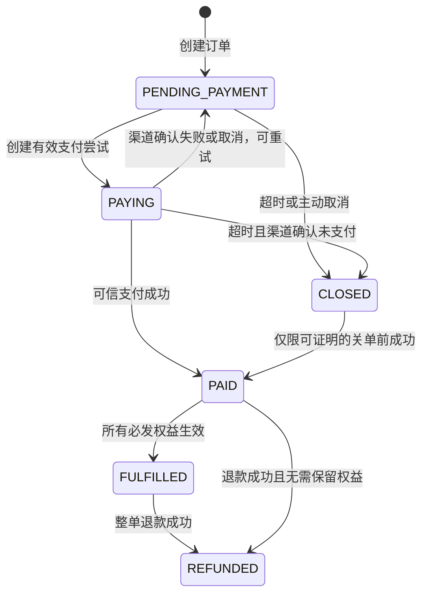
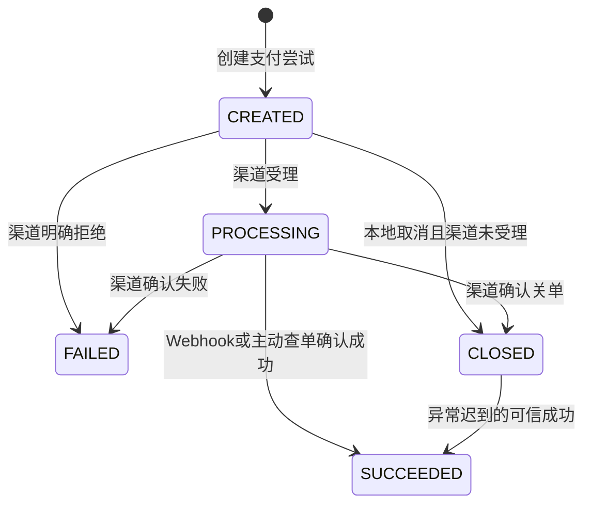
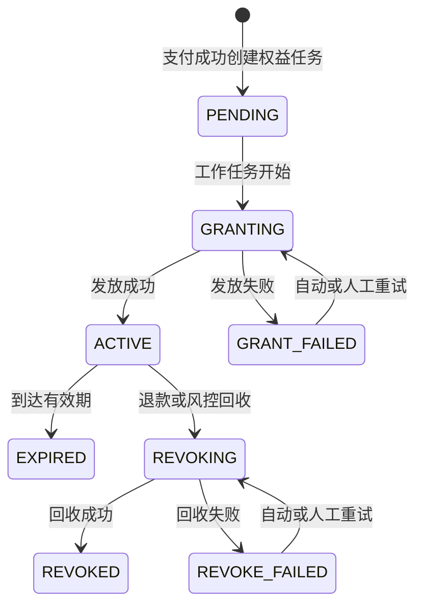

# 订单、支付与权益状态机

版本：V1.0  
状态：阶段 1 产品基线  
最后更新：2026-07-30

## 1. 文档目的

本文件定义一次商业化交易中三套彼此独立但相互协同的状态机：

- `Order.status`：用户和商户之间的业务交易进度。
- `PaymentAttempt.status`：某一次渠道付款尝试的资金结果。
- `UserEntitlement.status`：用户购买的服务或额度是否可用。

退款申请、渠道退款和权益回收过程分别记录在 `Refund.status`、`Refund.entitlement_action_status` 与权益状态中，不把所有售后过程塞入订单状态。

## 2. 通用状态设计规则

1. 每个状态只表达一个领域事实，不使用“部分成功”之类含糊状态。
2. 状态只能由拥有该对象的模块修改，其他模块通过命令或事件请求变化。
3. 客户端返回只影响页面提示，不能直接把支付改为成功。
4. 外部渠道的可信结果可以晚到，但必须经过验签、金额核对和事件去重。
5. 所有状态变化写入审计时间和交易时间线。
6. 对终态的重复请求返回当前结果，不重复执行副作用。
7. 状态变化失败不能丢失原事实，应进入重试、补偿或人工队列。

## 3. 订单状态机

### 3.1 状态定义

| 状态 | 中文含义 | 进入条件 | 用户侧表现 | 是否终态 |
|---|---|---|---|---|
| `PENDING_PAYMENT` | 待支付 | 订单创建和价格校验完成 | 显示应付金额与支付入口 | 否 |
| `PAYING` | 支付中 | 已创建有效支付尝试 | 显示“等待支付结果”，允许刷新 | 否 |
| `PAID` | 已支付待履约 | 可信支付结果确认成功 | 显示“支付成功，权益处理中” | 否 |
| `FULFILLED` | 已履约 | 所有必发权益均已生效 | 显示购买成功和权益详情 | 业务完成终态 |
| `CLOSED` | 已关闭 | 超时、用户取消订单或风控关闭 | 不允许继续发起新支付 | 通常终态 |
| `REFUNDED` | 已退款 | 整单退款成功且售后结果已记录 | 显示退款结果及权益处理结果 | 售后终态 |

`PAID` 不是异常状态。它表示资金已确认，但履约尚未全部完成；权益发放失败时订单仍保持 `PAID`。

### 3.2 状态图



### 3.3 转换规则

| 编号 | 原状态 | 目标状态 | 触发方 | 前置条件与校验 | 主要数据变化 | 失败处理 |
|---|---|---|---|---|---|---|
| O-01 | 无 | `PENDING_PAYMENT` | 订单服务 | 用户、SKU、价格和可售时间有效 | 创建订单和订单明细快照 | 返回明确错误，不创建半成品订单 |
| O-02 | `PENDING_PAYMENT` | `PAYING` | 支付服务 | 订单未过期，存在有效支付尝试 | 记录当前支付尝试与更新时间 | 支付单创建失败时保持待支付 |
| O-03 | `PAYING` | `PENDING_PAYMENT` | 支付服务 | 渠道确认失败、取消或关单，订单仍有效 | 保存失败原因，允许新支付尝试 | 客户端取消不直接触发转换，需先查单确认 |
| O-04 | `PAYING` | `PAID` | 支付服务 | 验签、金额、商户号和订单匹配 | 写 `paid_at`，触发权益发放 | 事务失败则重试事件处理 |
| O-05 | `PENDING_PAYMENT/PAYING` | `CLOSED` | 订单服务 | 已超时且主动查单确认未支付，或风控关闭 | 写关闭原因和时间 | 查单不确定时不关闭，保持支付中 |
| O-06 | `PAID` | `FULFILLED` | 权益服务 | 所有必发权益都为 `ACTIVE` | 写 `fulfilled_at` | 任一权益失败时保持已支付并补偿 |
| O-07 | `PAID/FULFILLED` | `REFUNDED` | 退款服务 | 整单退款成功；权益处理结果已记录 | 写退款完成时间 | 权益回收失败不回退退款事实 |
| O-08 | `CLOSED` | `PAID` | 支付补偿任务 | 验证渠道实际支付时间不晚于订单过期时间 | 记录迟到回调原因，继续履约 | 支付发生在过期后则进入异常退款队列 |

### 3.4 禁止转换

- `PAID/FULFILLED -> PENDING_PAYMENT`：资金成功事实不能因履约失败被抹掉。
- `REFUNDED -> PAID/FULFILLED`：退款后的重新购买必须创建新订单。
- `CLOSED -> PAYING`：已关闭订单不能再创建新支付尝试。
- `FULFILLED -> PAID`：权益后续异常通过权益状态和补偿表达，不回退订单。

## 4. 支付尝试状态机

### 4.1 状态定义

| 状态 | 中文含义 | 进入条件 | 产品解释 | 是否终态 |
|---|---|---|---|---|
| `CREATED` | 已创建 | 本地支付记录创建成功 | 尚未确认渠道是否受理 | 否 |
| `PROCESSING` | 处理中 | 渠道已受理或等待异步结果 | 资金结果不确定，需要回调或查单 | 否 |
| `SUCCEEDED` | 支付成功 | 渠道权威结果确认成功 | 可触发订单已支付和权益发放 | 资金终态 |
| `FAILED` | 支付失败 | 渠道权威结果确认失败 | 本次尝试结束，订单可再次支付 | 终态 |
| `CLOSED` | 已关闭 | 未支付且渠道关闭，或订单失效 | 本次尝试不再接受正常支付 | 通常终态 |

退款不是支付尝试状态。支付成功后发生退款，仍保留 `PaymentAttempt.status = SUCCEEDED`，退款结果记录在 `Refund` 中。

### 4.2 状态图



### 4.3 转换规则

| 编号 | 原状态 | 目标状态 | 触发方 | 前置条件与校验 | 主要数据变化 | 失败处理 |
|---|---|---|---|---|---|---|
| P-01 | 无 | `CREATED` | 支付服务 | 订单有效，金额和币种来自订单 | 创建商户支付单号和幂等键 | 相同幂等键返回已有记录 |
| P-02 | `CREATED` | `PROCESSING` | 支付服务 | 渠道成功受理下单请求 | 保存渠道参数和受理时间 | 网络超时时主动查单，不直接判失败 |
| P-03 | `CREATED/PROCESSING` | `FAILED` | 渠道回调或查单 | 权威失败结果、验签通过 | 保存标准失败码和渠道原始码 | 用户可创建新的支付尝试 |
| P-04 | `PROCESSING` | `SUCCEEDED` | Webhook 或查单任务 | 验签通过；订单号、金额、币种、商户号一致 | 保存渠道流水和成功时间 | 任一不符进入风险异常，不更新成功 |
| P-05 | `CREATED/PROCESSING` | `CLOSED` | 支付服务 | 订单失效且渠道确认未支付或已关单 | 保存关闭原因和时间 | 渠道状态未知时继续查询 |
| P-06 | `CLOSED` | `SUCCEEDED` | 支付补偿任务 | 渠道证明资金实际成功 | 保留关单异常痕迹并更新资金事实 | 根据支付时间决定履约或退款 |

### 4.4 回调处理顺序

```text
接收原始请求
-> 根据渠道规则验签
-> 用 provider + provider_event_id 去重
-> 匹配商户支付单号
-> 核对商户号、金额、币种和订单
-> 保存 PaymentEvent
-> 转换 PaymentAttempt 状态
-> 更新 Order 状态
-> 写入待发放权益事件
-> 返回渠道要求的确认响应
```

保存事件和业务处理需要保证“事件不会丢”。如果不能在一个数据库事务中完成，应使用可靠事件表或 Outbox 机制，由后续研发方案明确实现。

### 4.5 冲突事件处理

| 当前状态 | 新事件 | 处理策略 |
|---|---|---|
| `SUCCEEDED` | 重复成功 | 返回成功确认，标记重复，不再次发权益 |
| `SUCCEEDED` | 失败/关闭 | 保留成功状态，记录冲突告警并主动查单 |
| `FAILED` | 重复失败 | 幂等忽略 |
| `FAILED` | 成功 | 不自动覆盖，主动查单确认后进入人工/补偿处理 |
| `CLOSED` | 成功 | 记录迟到支付，根据实际支付时间履约或退款 |
| 任意状态 | 验签失败 | 不改变状态，记录安全事件 |
| 任意状态 | 金额不一致 | 不改变状态，进入风险异常队列 |

## 5. 用户权益状态机

### 5.1 状态定义

| 状态 | 中文含义 | 进入条件 | 用户侧表现 | 是否终态 |
|---|---|---|---|---|
| `PENDING` | 待发放 | 支付成功并生成权益任务 | 显示“权益处理中” | 否 |
| `GRANTING` | 发放中 | 权益服务取得任务并开始处理 | 继续显示处理中 | 否 |
| `ACTIVE` | 已生效 | 权益写入成功并可使用 | 展示有效期或剩余额度 | 否 |
| `GRANT_FAILED` | 发放失败 | 发放过程出现可记录错误 | 显示处理中或联系客服，不显示支付失败 | 否 |
| `REVOKING` | 回收中 | 退款或风控要求回收权益 | 限制继续消费，显示售后处理中 | 否 |
| `REVOKE_FAILED` | 回收失败 | 回收过程失败 | 用户退款事实不回退，转人工处理 | 否 |
| `REVOKED` | 已撤销 | 权益回收成功 | 不再可用 | 终态 |
| `EXPIRED` | 已过期 | 到达有效期且无续期 | 不再可用，可引导续费 | 终态 |

### 5.2 状态图



### 5.3 转换规则

| 编号 | 原状态 | 目标状态 | 触发方 | 前置条件与校验 | 主要数据变化 | 失败处理 |
|---|---|---|---|---|---|---|
| E-01 | 无 | `PENDING` | 权益服务 | 支付成功，订单明细含有效权益快照 | 创建用户权益或待发放记录 | 相同发放幂等键返回已有结果 |
| E-02 | `PENDING/GRANT_FAILED` | `GRANTING` | 权益任务 | 获得任务锁，未超过重试限制 | 增加尝试次数，记录开始时间 | 未获得锁则稍后重试 |
| E-03 | `GRANTING` | `ACTIVE` | 权益服务 | 流水写入与当前权益更新成功 | 写有效期/余额和发放流水 | 事务失败则整体回滚并重试 |
| E-04 | `GRANTING` | `GRANT_FAILED` | 权益服务 | 可识别的业务或系统错误 | 保存错误码、重试次数和下次时间 | 超阈值转人工补发 |
| E-05 | `ACTIVE` | `EXPIRED` | 到期任务 | 当前时间达到有效期且无有效续期 | 写过期流水和时间 | 扫描失败可重复执行 |
| E-06 | `ACTIVE` | `REVOKING` | 退款/风控服务 | 存在有效回收指令，尚未重复处理 | 暂停额度消费或标记回收中 | 锁冲突时重试 |
| E-07 | `REVOKING` | `REVOKED` | 权益服务 | 回收流水和当前权益更新成功 | 清零/终止权益并写负向流水 | 事务失败整体回滚 |
| E-08 | `REVOKING` | `REVOKE_FAILED` | 权益服务 | 回收失败且已记录原因 | 保存错误码和重试计划 | 超阈值转人工处理 |
| E-09 | `REVOKE_FAILED` | `REVOKING` | 补偿任务/客服 | 修复原因或人工确认可重试 | 增加尝试次数和操作者信息 | 保持回收失败并记录新原因 |

### 5.4 权益幂等键

```text
发放：GRANT:{order_item_id}:{entitlement_definition_id}
退款回收：REVOKE:{refund_id}:{user_entitlement_id}
订阅续期：RENEW:{renewal_order_item_id}:{entitlement_definition_id}
```

同一幂等键再次请求时，返回首次成功结果或当前处理中状态，不重复增加余额和有效期。

## 6. 三套状态协同

### 6.1 正常购买

```text
Order.PENDING_PAYMENT
-> Order.PAYING + PaymentAttempt.PROCESSING
-> PaymentAttempt.SUCCEEDED + Order.PAID
-> UserEntitlement.PENDING/GRANTING
-> UserEntitlement.ACTIVE + Order.FULFILLED
```

### 6.2 支付失败后重试

```text
PaymentAttempt-1.FAILED
Order.PAYING -> Order.PENDING_PAYMENT
创建 PaymentAttempt-2
Order.PENDING_PAYMENT -> Order.PAYING
```

失败的支付尝试保留，不能覆盖成第二次尝试的结果。

### 6.3 支付成功但权益失败

```text
PaymentAttempt.SUCCEEDED
Order.PAID
UserEntitlement.GRANT_FAILED
```

用户看到“支付成功，权益处理中”；系统自动重试，超过阈值进入人工补发。只有权益转为 `ACTIVE` 后，订单才进入 `FULFILLED`。

### 6.4 全额退款但权益回收失败

```text
PaymentAttempt.SUCCEEDED       保持不变
Refund.status = SUCCEEDED
Refund.entitlement_action_status = FAILED
UserEntitlement.REVOKE_FAILED
Order.REFUNDED
```

资金已退事实不能因权益回收失败而回退；系统必须限制异常权益继续使用并进入人工处理。

## 7. 用户展示状态映射

前端不应直接展示内部枚举，应根据多个对象组合成用户可理解的状态。

| 订单 | 支付尝试 | 权益 | 用户展示 | 主要操作 |
|---|---|---|---|---|
| `PENDING_PAYMENT` | 无/失败 | 无 | 待支付 | 立即支付 |
| `PAYING` | `PROCESSING` | 无 | 等待支付结果 | 刷新结果、稍后查看 |
| `PAID` | `SUCCEEDED` | `PENDING/GRANTING` | 支付成功，权益处理中 | 刷新、联系客服 |
| `PAID` | `SUCCEEDED` | `GRANT_FAILED` | 支付成功，到账延迟 | 查看处理进度、联系客服 |
| `FULFILLED` | `SUCCEEDED` | `ACTIVE` | 购买成功 | 查看权益、开始使用 |
| `CLOSED` | `CLOSED/FAILED` | 无 | 订单已关闭 | 重新购买 |
| `REFUNDED` | `SUCCEEDED` | `REVOKED` | 已退款 | 查看退款详情 |
| `REFUNDED` | `SUCCEEDED` | `REVOKE_FAILED` | 已退款，权益处理中 | 无需再次申请，等待处理 |

## 8. 后台异常队列

| 异常类型 | 进入条件 | 自动动作 | 人工动作 |
|---|---|---|---|
| 支付状态未知 | 渠道请求超时且无回调 | 定时主动查单 | 查看渠道后台并确认 |
| 迟到支付 | 已关闭支付尝试收到成功 | 核对实际支付时间 | 决定履约或退款 |
| 支付信息不一致 | 金额、币种、商户号不匹配 | 阻止状态更新并告警 | 核查渠道和业务订单 |
| 权益发放失败 | `GRANT_FAILED` 超过自动重试阈值 | 指数退避重试 | 补发或标记无需发放 |
| 权益回收失败 | `REVOKE_FAILED` 超过阈值 | 重试并限制消费 | 手工回收或风险处置 |
| 事件状态冲突 | 成功后又收到失败等冲突事件 | 主动查单 | 确认最终资金事实 |

所有人工动作必须记录操作者、原因、前后状态和时间。

## 9. 状态机验收清单

- 每个状态都有唯一业务含义和归属对象。
- 每个转换都有触发方、前置条件、数据变化和失败处理。
- 所有重复请求都有幂等结果。
- 客户端不能直接产生支付成功。
- 支付成功事实不会因权益失败被回退。
- 权益成功不会因重复回调被重复增加。
- 退款成功与权益回收失败可以同时成立并可追踪。
- 关闭订单收到迟到支付时有明确处理路径。
- 前端展示状态由组合映射产生，不直接暴露内部枚举。
- 自动重试有次数和间隔，超过阈值有人工入口。

## 10. 产品与研发评审问题

1. 哪个模块拥有每个状态字段的写权限？
2. 状态更新与事件写入是否需要同一事务？
3. 主动查单在什么情况下触发，多久停止？
4. Webhook 重复、乱序和冲突分别如何识别？
5. 权益发放的业务幂等键是否有数据库唯一约束？
6. 任务重试期间，用户页面如何展示并避免重复购买？
7. 订单关闭后发生真实扣款，履约还是退款由什么规则决定？
8. 人工补发和人工回收是否进入相同的权益流水？
9. 状态变更是否都有统一的时间线事件和关联 ID？
10. 数据看板统计支付成功、履约成功和退款后净收入分别取哪个事实？

## 11. 面试中的 30 秒讲法

> 我把订单、支付和权益设计成三套状态机。订单表达用户买什么和是否履约；一次订单可以有多次支付尝试，支付状态只表达某次资金结果；权益状态表达服务是否真正到账。支付成功后订单先进入已支付，权益通过幂等任务发放，全部生效后订单才进入已履约。如果支付成功但权益失败，支付事实不会回退，系统进入补偿并给用户展示“权益处理中”。这样可以处理重复回调、迟到通知和部分成功，而不是把所有问题塞进一个“支付状态”。
