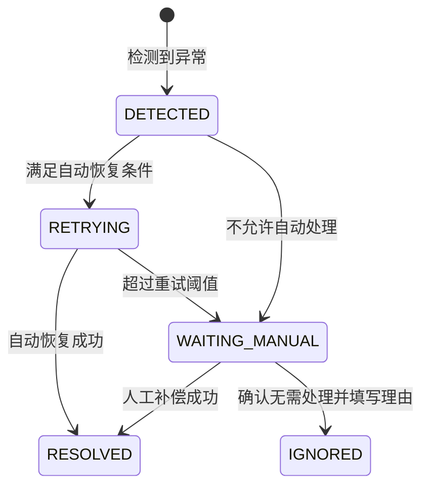

# 异常场景与补偿矩阵

版本：V1.0  
状态：阶段 1 产品基线  
最后更新：2026-07-30

## 1. 文档目的

本文件定义商业化闭环出现异常时，系统如何发现、阻断、重试、补偿、通知用户、转人工和验收。

异常设计的目标不是保证“永远不失败”，而是保证：

- 外部资金事实不丢失、不伪造。
- 用户不会因为系统局部失败而重复付款或重复获得权益。
- 自动恢复失败后，有明确的异常工单、负责人和人工操作入口。
- 每次恢复都可追溯、可重复执行且不会制造第二次错误。

## 2. 异常分类

| 类型 | 定义 | 默认策略 | 示例 |
|---|---|---|---|
| `BUSINESS_REJECT` | 不满足明确业务规则 | 阻止操作，提示用户修正 | SKU 下架、订单过期 |
| `TRANSIENT` | 网络、锁、临时服务不可用 | 幂等自动重试 | 渠道超时、数据库短暂失败 |
| `INCONSISTENCY` | 多方数据或状态不一致 | 停止推进，查单并转异常中心 | 金额不一致、成功后又收到失败 |
| `SECURITY_RISK` | 验签、授权、身份或风控异常 | 拒绝请求、记录安全事件、告警 | Webhook 验签失败、OAuth state 不匹配 |
| `MANUAL_REVIEW` | 需要业务人员判断 | 创建异常工单并限制高风险操作 | 已消费额度申请退款 |

## 3. 严重等级与处理目标

| 等级 | 判断标准 | 示例 | 产品建议响应目标 |
|---|---|---|---|
| `S1` | 可能造成资金损失、批量重复权益或安全事件 | 重复发放、金额校验失效、密钥泄漏 | 立即告警，15 分钟内开始处置，暂停相关高风险能力 |
| `S2` | 单笔资金已成功但履约/退款异常，用户明显受损 | 支付成功权益未到账、退款成功权益未回收 | 自动恢复同时创建可见工单，2 小时内人工接管 |
| `S3` | 无资金损失，可由用户重试或后台日常处理 | SKU 下架、登录 Token 过期 | 明确提示，进入普通监控或客服流程 |

SLA 是项目建议基线，实际生产目标需要结合团队值班能力、渠道规则和业务量确认。

## 4. 补偿通用规则

### 4.1 不回滚外部事实

- 渠道确认支付成功后，不能因为权益失败把支付改回失败。
- 渠道确认退款成功后，不能因为权益回收失败把退款改回失败。
- 外部事实只能通过新的业务动作纠正，例如退款、补发或人工调整。

### 4.2 重试必须幂等

每次补偿使用稳定业务幂等键。重复运行只能返回已有结果，不能重复扣款、发放或回收。

### 4.3 建议重试节奏

| 任务 | 建议自动重试 | 超限动作 |
|---|---|---|
| 支付主动查单 | 10 秒、30 秒、2 分钟、5 分钟、15 分钟；30 分钟后降频 | 状态仍未知则创建 S2 工单 |
| Webhook 内部处理 | 立即、10 秒、1 分钟、5 分钟、15 分钟 | 5 次失败后创建 S1/S2 工单 |
| 权益发放/回收 | 立即、1 分钟、5 分钟、15 分钟 | 4 次失败后转人工 |
| 渠道退款查询 | 30 秒、2 分钟、10 分钟、30 分钟 | 根据渠道最长处理时间转人工 |
| 对账差异复核 | 下一批次自动再核一次 | 连续两批仍异常转财务 |

本地演示会缩短时间，但重试次数、顺序和转人工条件保持一致。

### 4.4 异常工单生命周期

异常工单关闭必须包含解决方式、操作者、结果和时间。`IGNORED` 不能用于掩盖未查明的资金差异。

## 5. 订单异常

| ID | 场景与分类 | 检测方式 | 系统即时处理 | 用户反馈 | 自动恢复与人工动作 | 验收要点 |
|---|---|---|---|---|---|---|
| `ORD-01` | 重复创建订单；`TRANSIENT` | 相同用户、业务场景和创建幂等键 | 返回已有未过期订单 | 正常进入原订单 | 无需工单 | 连续请求 3 次只生成 1 个订单 |
| `ORD-02` | SKU 下架、停售或超出可售时间；`BUSINESS_REJECT` | 创建订单时校验 SKU | 拒绝创建订单，不产生支付记录 | “该商品暂不可购买” | 引导刷新商品列表 | 数据库无半成品订单 |
| `ORD-03` | 前端价格与后台价格不同；`BUSINESS_REJECT` | 后端重新计算价格 | 使用后台价格并要求用户确认，不信任前端金额 | 展示最新价格 | 用户确认后重新提交 | 不能按前端篡改价格创建订单 |
| `ORD-04` | 订单超时但支付状态未知；`INCONSISTENCY` | 到期扫描发现处理中支付 | 保持 `PAYING`，先主动查单，不直接关闭 | “正在确认支付结果” | 查单未支付后关闭；仍未知创建 S2 工单 | 未确认渠道结果前不允许重复支付 |
| `ORD-05` | 已关闭订单收到支付成功；`INCONSISTENCY` | Webhook 匹配到关闭订单 | 验签和查单，记录迟到支付 | “支付结果处理中” | 关单前实际成功则履约；关单后成功则退款/人工 | 两条分支均保留完整时间线 |

## 6. 支付发起与结果异常

| ID | 场景与分类 | 检测方式 | 系统即时处理 | 用户反馈 | 自动恢复与人工动作 | 验收要点 |
|---|---|---|---|---|---|---|
| `PAY-01` | 创建支付请求网络超时；`TRANSIENT` | 渠道调用超时 | 支付尝试保持 `CREATED/PROCESSING`，不直接判失败 | “正在确认，请勿重复支付” | 使用商户支付单号主动查单 | 超时重试不会创建多个渠道支付单 |
| `PAY-02` | 用户在客户端取消支付；`BUSINESS_REJECT` | 客户端返回取消 | 只更新页面，不依据客户端改资金终态 | “已取消，确认结果后可重试” | 主动查单确认未支付后允许新尝试 | 伪造客户端成功/失败不能改服务端状态 |
| `PAY-03` | 用户支付后关闭页面；`TRANSIENT` | 页面无返回但服务端收到回调 | 正常处理回调和权益 | 再次进入可查询最终结果 | 无需人工 | 关闭页面后仍能完成订单和权益 |
| `PAY-04` | Webhook 重复；`TRANSIENT` | 相同 `provider + provider_event_id` | 返回渠道成功确认，标记重复，不重复处理 | 无感知 | 无需工单，计入重复事件指标 | 重放 3 次只产生 1 次状态变化和权益 |
| `PAY-05` | Webhook 验签失败；`SECURITY_RISK` | 渠道适配器验签 | 保存脱敏事件，拒绝状态变化 | 不展示“支付失败”，保持确认中 | S1 告警；达到阈值暂停渠道入口 | 任意伪造回调不能改变订单或权益 |
| `PAY-06` | 回调金额、币种或商户号不一致；`SECURITY_RISK` | 与支付尝试及商户配置核对 | 不更新支付成功，创建 S1 工单 | “支付结果核实中” | 主动查单和人工核查 | 差 1 分也必须阻断自动履约 |
| `PAY-07` | 商户支付单号无法匹配；`INCONSISTENCY` | 查无 `merchant_trade_no` | 保存孤立事件，不创建订单 | 用户侧无订单可展示 | S1/S2 工单，核查商户号和环境 | 不允许通过回调反向创建业务订单 |
| `PAY-08` | 成功后收到失败/关闭事件；`INCONSISTENCY` | 当前状态为 `SUCCEEDED` | 保留成功状态并记录冲突 | 保持已支付/已履约 | 主动查单；持续冲突转 S1 | 后到失败不能覆盖已确认成功 |
| `PAY-09` | 失败后收到成功事件；`INCONSISTENCY` | 当前状态为 `FAILED` | 不直接覆盖，先主动查单 | “支付结果核实中” | 查单确认成功后受控补偿；否则忽略 | 需保留两次事件和最终判断依据 |
| `PAY-10` | 保存支付成功时数据库事务失败；`TRANSIENT` | Webhook 处理异常 | 渠道事件保持待处理，向渠道按协议响应 | “正在确认支付结果” | 可靠事件任务重试；超限 S1/S2 | 重试后状态与权益完整且不重复 |
| `PAY-11` | 同一订单出现两个成功支付尝试；`INCONSISTENCY` | 订单下多条 `SUCCEEDED` | 先履约一次，锁定异常多收款 | 告知存在重复付款处理 | 自动发起额外款项退款或转人工 | 权益只能发一次，额外资金可追踪 |

## 7. 权益异常

| ID | 场景与分类 | 检测方式 | 系统即时处理 | 用户反馈 | 自动恢复与人工动作 | 验收要点 |
|---|---|---|---|---|---|---|
| `ENT-01` | 支付成功事件重复触发发放；`TRANSIENT` | 相同发放幂等键 | 返回已有权益结果 | 无感知 | 无需工单 | 有效期和余额只增加一次 |
| `ENT-02` | 权益服务暂时不可用；`TRANSIENT` | 发放调用超时/服务错误 | 权益进入 `GRANT_FAILED`，订单保持 `PAID` | “支付成功，权益处理中” | 4 次自动重试，超限 S2 工单 | 不能提示支付失败或要求重新付款 |
| `ENT-03` | 订单权益快照缺失或不可解析；`INCONSISTENCY` | 发放前校验快照 | 阻止发放，创建 S1/S2 工单 | “权益到账延迟” | 人工依据订单审计数据补发 | 不允许临时读取当前 SKU 规则替代快照 |
| `ENT-04` | 并发发放或额度更新冲突；`TRANSIENT` | 唯一约束或版本号冲突 | 当前事务回滚 | 无感知或短暂处理中 | 带同一幂等键重试 | 并发 10 次仍只发一份权益 |
| `ENT-05` | 人工补发重复提交；`TRANSIENT` | 原始发放幂等键已成功 | 返回已补发结果，不再次增加 | 展示当前权益 | 记录重复人工操作 | 人工按钮多次点击不重复发放 |
| `ENT-06` | 到期任务漏跑；`TRANSIENT` | 当前时间超过 `valid_to` 但仍为 `ACTIVE` | 使用权益时再次校验有效期并拒绝 | 显示已过期 | 补偿扫描更新状态和流水 | 即使批任务失败也不能继续使用过期权益 |
| `ENT-07` | 用户账号合并后权益归属冲突；`MANUAL_REVIEW` | 两个用户存在同类有效权益 | 暂停自动覆盖 | 提示账号处理中 | 人工选择合并、叠加或保留规则 | 原始订单和权益来源必须保留 |

## 8. 退款与权益回收异常

| ID | 场景与分类 | 检测方式 | 系统即时处理 | 用户反馈 | 自动恢复与人工动作 | 验收要点 |
|---|---|---|---|---|---|---|
| `RFD-01` | 重复退款申请；`TRANSIENT` | 相同退款幂等键或已有处理中退款 | 返回已有退款单 | 展示原退款进度 | 无需新工单 | 不重复向渠道退款 |
| `RFD-02` | 累计退款超过支付金额；`BUSINESS_REJECT` | 创建退款时计算可退金额 | 拒绝退款请求 | “退款金额超过可退金额” | 客服核查历史退款 | 渠道调用次数为 0 |
| `RFD-03` | 渠道退款请求超时；`TRANSIENT` | 调用超时 | 保持退款处理中，不重新生成退款号 | “退款处理中” | 用退款号主动查询 | 网络重试不产生重复退款 |
| `RFD-04` | 渠道退款成功但权益回收失败；`INCONSISTENCY` | 退款成功且权益为 `REVOKE_FAILED` | 订单记已退款，限制权益消费 | “退款成功，权益处理中” | 自动回收重试，超限 S2 工单 | 资金事实不因回收失败回退 |
| `RFD-05` | 额度已经部分使用；`MANUAL_REVIEW` | 退款前比较发放量与剩余量 | 用户端不自动退款 | “该订单需人工审核” | 客服按政策拒绝、按比例处理或特批 | 决策、操作者和理由可审计 |
| `RFD-06` | 会员已过期后退款；`BUSINESS_REJECT/MANUAL_REVIEW` | 权益状态为 `EXPIRED` | 按退款政策判断，不创建无意义回收任务 | 展示审核结果 | 必要时人工审核 | 退款与是否可回收权益分开判断 |
| `RFD-07` | 退款成功通知重复；`TRANSIENT` | 相同退款渠道事件号 | 幂等忽略 | 无感知 | 无需工单 | 订单和权益只变化一次 |

## 9. 对账异常

| ID | 场景与分类 | 检测方式 | 系统即时处理 | 自动恢复与人工动作 | 验收要点 |
|---|---|---|---|---|---|
| `REC-01` | 渠道有成功流水，系统无支付记录 | 渠道账单匹配失败 | 创建长款差异，不自动创建权益 | 核查环境、商户号和原始事件，必要时退款 | 差异可关联渠道流水并关闭 |
| `REC-02` | 系统支付成功，渠道账单无记录 | 系统成功记录匹配失败 | 创建短款差异，暂停收入确认 | 次日账单重核，仍缺失则财务/渠道处理 | 不能仅靠系统状态确认收入 |
| `REC-03` | 系统金额与渠道金额不同 | 金额对比 | 创建金额差异并锁定自动处理 | 核对手续费、币种、退款和渠道配置 | 原金额不可直接被人工覆盖 |
| `REC-04` | 渠道退款成功，系统退款仍处理中 | 退款账单匹配 | 主动查询退款并补偿状态 | 自动恢复失败转财务工单 | 不重复发起退款 |
| `REC-05` | 重复渠道账单行 | 账单行唯一键冲突 | 幂等忽略重复行 | 无需人工，记录质量指标 | 重复导入不会制造差异 |

## 10. 登录与开放平台异常

| ID | 场景与分类 | 检测方式 | 系统即时处理 | 用户反馈 | 自动恢复与人工动作 | 验收要点 |
|---|---|---|---|---|---|---|
| `AUTH-01` | OAuth `state` 不匹配；`SECURITY_RISK` | 回调参数校验 | 拒绝登录，不交换 Token | “登录验证失败，请重试” | 记录安全事件 | 修改 state 无法登录 |
| `AUTH-02` | 授权码重复使用；`SECURITY_RISK` | 授权码一次性校验 | 拒绝第二次交换 | “登录已失效，请重新授权” | 无自动重试 | 同一码只能成功一次 |
| `AUTH-03` | 回调地址不在白名单；`SECURITY_RISK` | 精确匹配 redirect URI | 拒绝授权 | 面向开发者显示配置错误 | 开发者修改配置 | 子域、路径或参数不匹配均拒绝 |
| `AUTH-04` | 第三方身份已绑定其他用户；`MANUAL_REVIEW` | 唯一约束冲突 | 不自动合并账号 | “该账号已绑定其他账户” | 身份验证后走账号申诉/合并 | 不允许覆盖原绑定关系 |
| `AUTH-05` | Access Token 过期或撤销；`BUSINESS_REJECT` | API 鉴权 | 返回标准未授权错误 | 引导重新登录或刷新 | 合法 Refresh Token 可换新 | 撤销后旧 Token 立即失效 |
| `AUTH-06` | 请求 Scope 超出授权；`SECURITY_RISK` | API 权限校验 | 返回禁止访问 | 开发者看到缺少权限 | 重新发起授权 | Token 存在也不能越权调用 |
| `AUTH-07` | Client Secret 泄漏疑似异常；`SECURITY_RISK` | 调用行为或人工报告 | 吊销密钥和相关 Token | 开发者收到安全通知 | 重新生成密钥并审计调用 | 旧密钥不能恢复使用 |

## 11. 任务与可观测异常

| ID | 场景与分类 | 检测方式 | 系统即时处理 | 自动恢复与人工动作 | 验收要点 |
|---|---|---|---|---|---|
| `OPS-01` | 补偿任务长期未执行 | `next_retry_at` 超时监控 | 创建/升级异常工单 | 重启任务、重新入队或人工补偿 | 不存在无负责人长期卡住的任务 |
| `OPS-02` | 时间线事件写入失败 | 核心流程捕获写入失败 | 核心交易不因展示日志失败而回滚；写入可靠事件表 | 异步补写，持续失败告警 | 最终能还原核心状态变化 |
| `OPS-03` | 人工操作无理由或越权 | 权限与必填校验 | 拒绝操作 | 管理员修正权限或补充理由 | 所有人工补发/回收/忽略均可审计 |
| `OPS-04` | 单一异常短时间批量发生 | 指标阈值和聚合规则 | 将单笔工单升级为渠道/系统级事件 | 暂停高风险入口，通知负责人 | 批量问题不会只生成大量无人处理单据 |

## 12. 用户反馈原则

1. 资金未确认时，不提示“支付失败”，使用“正在确认支付结果”。
2. 支付已成功但权益失败时，明确告诉用户“支付成功”，避免再次支付。
3. 不向用户暴露签名、数据库、堆栈或渠道内部错误码。
4. 用户可从订单页看到处理进度、更新时间和客服入口。
5. 系统已接管补偿时，不要求用户反复提交相同操作。
6. 退款成功但权益处理中时，不能显示“退款失败”。

## 13. 后台异常中心最小能力

- 按严重等级、异常编码、渠道、状态、时间和负责人筛选。
- 通过订单号、商户支付单号、渠道流水号和退款号搜索。
- 查看订单、支付事件、权益流水、退款和时间线的关联详情。
- 执行主动查单、重试发放、人工补发、重试回收、发起退款和忽略工单。
- 高风险操作二次确认，并要求填写原因。
- 展示自动重试次数、下次时间、最近错误和处理 SLA。
- 所有操作写审计记录，不允许直接编辑数据库状态。

## 14. 核心验收场景

| 验收编号 | 操作 | 预期结果 |
|---|---|---|
| `AT-EX-01` | 同一创建订单请求发送 3 次 | 只有 1 个订单，三次返回相同订单号 |
| `AT-EX-02` | 同一成功 Webhook 重放 3 次 | 1 个成功事件生效、1 次权益发放、其余标记重复 |
| `AT-EX-03` | 发送正确签名但金额差 1 分的回调 | 支付不成功、权益不发放、生成 S1 工单 |
| `AT-EX-04` | 支付成功后模拟权益服务连续失败 | 订单保持已支付、用户看到到账延迟、达到阈值转人工 |
| `AT-EX-05` | 权益失败后执行人工补发两次 | 只成功发放一次，第二次返回已有结果 |
| `AT-EX-06` | 模拟退款成功、权益回收失败 | 订单显示已退款，权益进入回收失败工单 |
| `AT-EX-07` | 支付过程中关闭页面后发送成功回调 | 再次进入订单页可看到成功和权益 |
| `AT-EX-08` | 已关闭订单发送迟到成功 | 根据渠道支付时间进入履约或退款分支 |
| `AT-EX-09` | 使用错误 OAuth state 回调 | 登录失败，不创建会话，记录安全事件 |
| `AT-EX-10` | 导入同一渠道账单两次 | 不重复入账，不生成重复差异 |

## 15. 产品与研发评审问题

1. 哪些异常可以自动重试，哪些必须禁止自动处理？
2. 每类重试的幂等键、次数、间隔和停止条件是什么？
3. 外部调用超时时，系统如何区分“失败”和“结果未知”？
4. 哪些异常需要立即阻断支付入口或开放平台应用？
5. 用户如何知道系统已接管问题，而不是再次支付或重复申请？
6. 人工补偿调用正式业务接口还是直接改库？必须使用前者。
7. 异常工单如何关联订单、支付、权益、退款和对账记录？
8. S1/S2 的告警、负责人和升级机制是什么？
9. 如何用自动化测试证明重复和并发不会造成资金或权益错误？
10. 哪些原始载荷需要保留，如何脱敏和控制访问权限？

## 16. 面试中的 30 秒讲法

> 我把异常分成业务拒绝、临时故障、数据不一致、安全风险和人工审核五类。临时故障可以幂等重试，金额不一致或验签失败必须阻断状态推进，自动恢复超过阈值后进入异常工单。最重要的原则是不回滚外部事实：支付成功但权益失败，就保持支付成功并补发；退款成功但权益回收失败，就保持退款成功并继续回收。用户侧明确展示系统正在处理，后台通过订单号、支付单号和渠道流水追踪全链路，所有人工补偿都走受控接口并留下审计。
