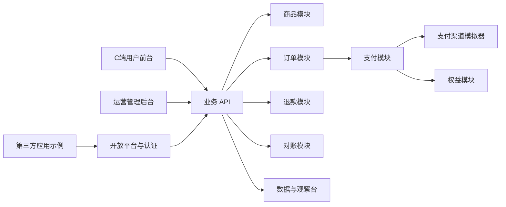
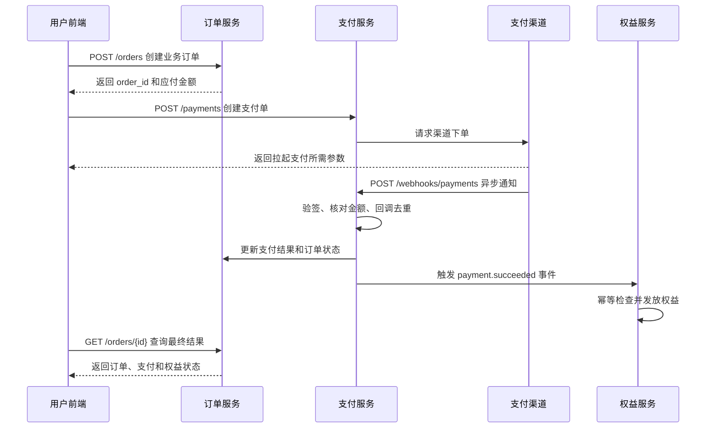

# 系统总览与支付闭环

## 1. 系统模块



## 2. 支付成功到权益到账



## 3. 为什么需要三套状态

### 订单状态

描述用户与商户之间的业务交易：

```text
PENDING_PAYMENT -> PAYING -> PAID -> FULFILLED
       |              |        |         |
       +-> CLOSED     +-> FAILED         +-> REFUNDED
```

### 支付状态

描述商户与支付渠道之间的资金处理：

```text
CREATED -> PROCESSING -> SUCCEEDED -> REFUNDING -> REFUNDED
                  |
                  +-> FAILED
```

### 权益状态

描述用户最终获得和使用的服务：

```text
PENDING -> ACTIVE -> EXPIRED
    |
    +-> GRANT_FAILED -> ACTIVE
    |
    +-> REVOKED
```

“支付成功但权益未到账”应被记录为：

```text
order.status = PAID
payment.status = SUCCEEDED
entitlement.status = GRANT_FAILED
```

此时产品策略应是补发与告知，不能要求用户重新支付。

## 4. 核心职责边界

| 环节 | 前端职责 | 后端职责 | 产品经理必须定义 |
|---|---|---|---|
| 创建订单 | 提交 SKU 和必要上下文 | 校验商品、计算价格、保存快照 | 重复下单、价格变化、订单有效期 |
| 拉起支付 | 展示方式、调用渠道能力 | 创建支付单、生成支付参数 | 支付方式、失败提示、重试入口 |
| 支付回调 | 不参与最终判定 | 验签、核对、去重、更新状态 | 可信结果来源、异常处理、时效 |
| 权益发放 | 展示到账结果 | 幂等发放、失败重试 | 权益内容、生效与过期、补发规则 |
| 查询结果 | 轮询或主动刷新 | 聚合订单、支付、权益状态 | 等待文案、超时策略、人工入口 |
| 退款 | 提交原因、展示进度 | 校验可退、请求渠道、回收权益 | 审核、部分退款、权益回收规则 |

## 5. 交易链路观察台

观察台是本项目最重要的学习能力。每笔交易展示：

- 事件名称与时间。
- 接口路径、请求字段和响应字段。
- 业务对象及状态变化。
- 数据表写入或更新结果。
- 幂等键、渠道事件 ID 和关联 ID。
- 当前步骤失败后的重试或人工处理方式。

示例事件：

```text
order.created
payment.created
payment.webhook.received
payment.succeeded
entitlement.grant.requested
entitlement.granted
order.fulfilled
```

## 6. 初步技术结构

- 用户端：React + TypeScript。
- 管理后台：React + TypeScript。
- 后端：NestJS，按业务领域拆分模块。
- 数据层：Prisma + SQLite，保留迁移 PostgreSQL 的说明。
- 接口说明：OpenAPI/Swagger。
- 端到端验收：Playwright。
- 支付渠道：本地模拟 Provider，不处理真实资金。

采用 NestJS 的主要原因不是追求复杂技术，而是其 Controller、Service、Repository 和 Module 边界清晰，适合产品经理理解请求入口、业务规则与数据持久化分别发生在哪里。
