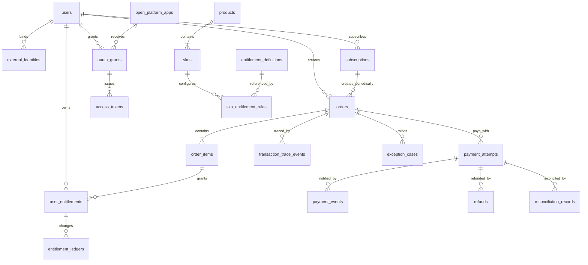

# 数据模型与字段字典

版本：V1.0  
状态：阶段 2 研发契约  
最后更新：2026-07-30

## 1. 文档目的

把《领域对象与关系字典》中的业务事实落成可由研发评审和实现的数据结构，并明确：

- 每张表保存什么事实。
- 哪些字段不可变、可为空或需要脱敏。
- 哪些唯一约束用于保证幂等和一致性。
- 哪些查询需要索引。
- 哪些写入必须在同一事务内完成。

本文是逻辑与物理模型之间的契约。实际 ORM 代码可以调整命名和类型，但不得删除关键约束或改变业务含义。

## 2. 数据设计约定

| 项目 | 约定 |
|---|---|
| 主键 | 使用不可推测的字符串 UUID；不复用业务编号 |
| 业务编号 | 订单号、支付单号和退款号分别全局唯一 |
| 金额 | 使用整数最小货币单位，例如人民币分；禁止浮点数 |
| 币种 | 使用大写 ISO 4217 代码，例如 `CNY`、`USD` |
| 时间 | 数据库存 UTC，API 返回 ISO 8601；页面按用户时区展示 |
| 状态 | 使用稳定英文枚举；中文仅用于展示 |
| 快照 | 订单中的商品、价格、权益规则使用不可变 JSON/TEXT 快照 |
| 删除 | 交易、支付、权益、退款和审计记录不物理删除 |
| 并发 | 权益余额等高风险字段使用 `version` 乐观锁或数据库原子更新 |
| 敏感数据 | 密钥和 Token 只存摘要；手机号、邮箱和载荷按权限脱敏 |
| 扩展字段 | 不使用无约束的万能 `extra` 代替明确业务字段 |

MVP 使用 SQLite 以保证面试环境本地可运行；生产参考使用 PostgreSQL。所有约束优先选择两者都能表达的方式。

## 3. 数据关系总图

## 4. 用户认证与开放平台表

### 4.1 `users`

| 字段 | 类型 | 可空 | 约束/索引 | 含义 |
|---|---|---|---|---|
| `id` | UUID/TEXT | 否 | PK | 内部用户 ID |
| `display_name` | VARCHAR(80) | 否 |  | 展示名称 |
| `mobile` | VARCHAR(32) | 是 | UNIQUE（非空） | 手机号，返回时脱敏 |
| `email` | VARCHAR(254) | 是 | UNIQUE（非空） | 邮箱，返回时脱敏 |
| `status` | VARCHAR(24) | 否 | INDEX | `ACTIVE/FROZEN/CLOSED` |
| `created_at` | TIMESTAMP | 否 | INDEX | 创建时间 |
| `updated_at` | TIMESTAMP | 否 |  | 更新时间 |

规则：至少保留一种可登录身份；冻结用户不能新购，但可以查看历史和发起允许的售后。

### 4.2 `external_identities`

| 字段 | 类型 | 可空 | 约束/索引 | 含义 |
|---|---|---|---|---|
| `id` | UUID/TEXT | 否 | PK | 外部身份 ID |
| `user_id` | UUID/TEXT | 否 | FK -> users, INDEX | 内部用户 |
| `provider` | VARCHAR(32) | 否 | UNIQUE 组合 | `MOCK/WECHAT/GOOGLE/APPLE` |
| `provider_subject` | VARCHAR(191) | 否 | UNIQUE 组合 | 第三方稳定用户标识 |
| `profile_snapshot` | JSON/TEXT | 是 |  | 脱敏资料快照 |
| `status` | VARCHAR(24) | 否 | INDEX | `BOUND/UNBOUND/RESTRICTED` |
| `last_login_at` | TIMESTAMP | 是 |  | 最近登录时间 |
| `created_at/updated_at` | TIMESTAMP | 否 |  | 审计时间 |

唯一约束：`UNIQUE(provider, provider_subject)`。

### 4.3 `open_platform_apps`

| 字段 | 类型 | 可空 | 约束/索引 | 含义 |
|---|---|---|---|---|
| `id` | UUID/TEXT | 否 | PK | 应用 ID |
| `owner_user_id` | UUID/TEXT | 否 | FK -> users, INDEX | 开发者/所有者 |
| `client_id` | VARCHAR(64) | 否 | UNIQUE | 对外应用标识 |
| `client_secret_hash` | VARCHAR(255) | 否 |  | 密钥摘要，不存明文 |
| `name` | VARCHAR(120) | 否 |  | 应用名称 |
| `redirect_uris` | JSON/TEXT | 否 |  | 精确白名单 |
| `allowed_scopes` | JSON/TEXT | 否 |  | 平台审批范围 |
| `status` | VARCHAR(24) | 否 | INDEX | `DRAFT/ACTIVE/DISABLED` |
| `created_at/updated_at` | TIMESTAMP | 否 |  | 审计时间 |

### 4.4 `oauth_grants`

| 字段 | 类型 | 可空 | 约束/索引 | 含义 |
|---|---|---|---|---|
| `id` | UUID/TEXT | 否 | PK | 授权 ID |
| `app_id` | UUID/TEXT | 否 | FK, INDEX | 开放平台应用 |
| `user_id` | UUID/TEXT | 否 | FK, INDEX | 授权用户 |
| `scopes` | JSON/TEXT | 否 |  | 用户实际授权范围 |
| `status` | VARCHAR(24) | 否 | INDEX | `ACTIVE/REVOKED/EXPIRED` |
| `granted_at` | TIMESTAMP | 否 |  | 授权时间 |
| `revoked_at` | TIMESTAMP | 是 |  | 撤销时间 |

### 4.5 `access_tokens`

| 字段 | 类型 | 可空 | 约束/索引 | 含义 |
|---|---|---|---|---|
| `id` | UUID/TEXT | 否 | PK | Token 记录 ID |
| `grant_id` | UUID/TEXT | 否 | FK, INDEX | 来源授权 |
| `token_hash` | VARCHAR(255) | 否 | UNIQUE | Access Token 摘要 |
| `refresh_token_hash` | VARCHAR(255) | 是 | UNIQUE | Refresh Token 摘要 |
| `scopes` | JSON/TEXT | 否 |  | 本 Token 权限 |
| `status` | VARCHAR(24) | 否 | INDEX | `ACTIVE/REVOKED/EXPIRED` |
| `expires_at` | TIMESTAMP | 否 | INDEX | 过期时间 |
| `created_at/revoked_at` | TIMESTAMP | 是 |  | 生命周期时间 |

## 5. 商品与权益配置表

### 5.1 `products`

| 字段 | 类型 | 可空 | 约束/索引 | 含义 |
|---|---|---|---|---|
| `id` | UUID/TEXT | 否 | PK | 产品 ID |
| `type` | VARCHAR(24) | 否 | INDEX | `MEMBERSHIP/QUOTA/FEATURE` |
| `name` | VARCHAR(120) | 否 |  | 产品名 |
| `description` | TEXT | 否 |  | 用户可读说明 |
| `status` | VARCHAR(24) | 否 | INDEX | `DRAFT/ACTIVE/INACTIVE` |
| `created_at/updated_at` | TIMESTAMP | 否 |  | 审计时间 |

### 5.2 `skus`

| 字段 | 类型 | 可空 | 约束/索引 | 含义 |
|---|---|---|---|---|
| `id` | UUID/TEXT | 否 | PK | SKU ID |
| `product_id` | UUID/TEXT | 否 | FK, INDEX | 所属产品 |
| `code` | VARCHAR(64) | 否 | UNIQUE | 稳定 SKU 编码 |
| `name` | VARCHAR(120) | 否 |  | 月卡、年卡等 |
| `billing_type` | VARCHAR(24) | 否 | INDEX | `ONE_TIME/SUBSCRIPTION` |
| `price_minor` | INTEGER | 否 | CHECK >= 0 | 当前售价，最小货币单位 |
| `currency` | CHAR(3) | 否 |  | 币种 |
| `sale_status` | VARCHAR(24) | 否 | INDEX | `ON_SALE/OFF_SALE/PAUSED` |
| `effective_from/to` | TIMESTAMP | 是 | INDEX | 可售时间 |
| `created_at/updated_at` | TIMESTAMP | 否 |  | 审计时间 |

### 5.3 `entitlement_definitions`

| 字段 | 类型 | 可空 | 约束/索引 | 含义 |
|---|---|---|---|---|
| `id` | UUID/TEXT | 否 | PK | 权益定义 ID |
| `code` | VARCHAR(64) | 否 | UNIQUE | 稳定权益编码 |
| `name` | VARCHAR(120) | 否 |  | 权益名称 |
| `type` | VARCHAR(24) | 否 | INDEX | `MEMBERSHIP/QUOTA/FEATURE` |
| `unit` | VARCHAR(24) | 否 |  | `DAY/POINT/BOOLEAN` |
| `stacking_rule` | VARCHAR(24) | 否 |  | `ADD/EXTEND/MAX/OVERWRITE` |
| `status` | VARCHAR(24) | 否 | INDEX | `ACTIVE/INACTIVE` |
| `created_at/updated_at` | TIMESTAMP | 否 |  | 审计时间 |

### 5.4 `sku_entitlement_rules`

| 字段 | 类型 | 可空 | 约束/索引 | 含义 |
|---|---|---|---|---|
| `id` | UUID/TEXT | 否 | PK | 规则 ID |
| `sku_id` | UUID/TEXT | 否 | FK, INDEX | 来源 SKU |
| `entitlement_definition_id` | UUID/TEXT | 否 | FK, INDEX | 目标权益 |
| `grant_value` | INTEGER | 否 | CHECK > 0 | 发放时长/数量 |
| `grant_timing` | VARCHAR(24) | 否 |  | `AFTER_PAYMENT/AFTER_REVIEW` |
| `created_at/updated_at` | TIMESTAMP | 否 |  | 审计时间 |

唯一约束：`UNIQUE(sku_id, entitlement_definition_id)`。

## 6. 订单与支付表

### 6.1 `orders`

| 字段 | 类型 | 可空 | 约束/索引 | 含义 |
|---|---|---|---|---|
| `id` | UUID/TEXT | 否 | PK | 内部订单 ID |
| `order_no` | VARCHAR(40) | 否 | UNIQUE | 用户/客服查询号 |
| `user_id` | UUID/TEXT | 否 | FK, INDEX | 下单用户 |
| `subscription_id` | UUID/TEXT | 是 | FK, INDEX | 续费来源订阅 |
| `order_type` | VARCHAR(24) | 否 | INDEX | `PURCHASE/SUBSCRIPTION_INITIAL/SUBSCRIPTION_RENEWAL` |
| `status` | VARCHAR(24) | 否 | INDEX | `PENDING_PAYMENT/PAYING/PAID/FULFILLED/CLOSED/REFUNDED` |
| `original_amount_minor` | INTEGER | 否 | CHECK >= 0 | 原价 |
| `payable_amount_minor` | INTEGER | 否 | CHECK >= 0 | 应付金额 |
| `currency` | CHAR(3) | 否 |  | 币种 |
| `close_reason` | VARCHAR(64) | 是 |  | 关闭原因 |
| `expires_at` | TIMESTAMP | 否 | INDEX | 支付截止时间 |
| `paid_at/fulfilled_at/refunded_at` | TIMESTAMP | 是 |  | 关键业务时间 |
| `created_at/updated_at` | TIMESTAMP | 否 | INDEX | 审计时间 |

推荐索引：`(user_id, created_at DESC)`、`(status, updated_at)`。

### 6.2 `order_items`

| 字段 | 类型 | 可空 | 约束/索引 | 含义 |
|---|---|---|---|---|
| `id` | UUID/TEXT | 否 | PK | 订单明细 ID |
| `order_id` | UUID/TEXT | 否 | FK, INDEX | 所属订单 |
| `sku_id` | UUID/TEXT | 否 | FK, INDEX | 原始 SKU |
| `sku_code_snapshot` | VARCHAR(64) | 否 |  | SKU 编码快照 |
| `sku_name_snapshot` | VARCHAR(120) | 否 |  | 名称快照 |
| `unit_price_minor_snapshot` | INTEGER | 否 | CHECK >= 0 | 单价快照 |
| `quantity` | INTEGER | 否 | CHECK > 0 | 数量 |
| `line_amount_minor` | INTEGER | 否 | CHECK >= 0 | 行金额 |
| `currency_snapshot` | CHAR(3) | 否 |  | 币种快照 |
| `entitlement_snapshot` | JSON/TEXT | 否 |  | 权益规则快照 |
| `created_at` | TIMESTAMP | 否 |  | 创建时间 |

MVP 每个订单只有一个明细，但数据模型允许后续扩展多个明细。

### 6.3 `payment_attempts`

| 字段 | 类型 | 可空 | 约束/索引 | 含义 |
|---|---|---|---|---|
| `id` | UUID/TEXT | 否 | PK | 支付尝试 ID |
| `order_id` | UUID/TEXT | 否 | FK, INDEX | 业务订单 |
| `merchant_trade_no` | VARCHAR(64) | 否 | UNIQUE | 商户支付单号 |
| `provider` | VARCHAR(32) | 否 | INDEX | 渠道编码 |
| `method` | VARCHAR(32) | 否 |  | 支付方式 |
| `provider_trade_no` | VARCHAR(128) | 是 | UNIQUE（非空） | 渠道支付流水 |
| `amount_minor` | INTEGER | 否 | CHECK >= 0 | 请求金额 |
| `currency` | CHAR(3) | 否 |  | 币种 |
| `status` | VARCHAR(24) | 否 | INDEX | `CREATED/PROCESSING/SUCCEEDED/FAILED/CLOSED` |
| `failure_code/provider_error_code` | VARCHAR(64) | 是 | INDEX | 标准与渠道错误码 |
| `idempotency_key` | VARCHAR(128) | 否 | UNIQUE | 创建支付幂等键 |
| `provider_paid_at` | TIMESTAMP | 是 |  | 渠道实际支付时间 |
| `created_at/updated_at` | TIMESTAMP | 否 | INDEX | 审计时间 |

必须通过事务或部分唯一约束保证同一订单最多一个成功支付尝试；SQLite MVP 可在事务内锁定/检查并配合业务唯一记录实现。

### 6.4 `payment_events`

| 字段 | 类型 | 可空 | 约束/索引 | 含义 |
|---|---|---|---|---|
| `id` | UUID/TEXT | 否 | PK | 内部事件 ID |
| `provider` | VARCHAR(32) | 否 | UNIQUE 组合 | 渠道 |
| `provider_event_id` | VARCHAR(128) | 否 | UNIQUE 组合 | 渠道事件号 |
| `payment_attempt_id` | UUID/TEXT | 是 | FK, INDEX | 匹配到的支付尝试 |
| `event_type` | VARCHAR(64) | 否 | INDEX | 标准事件类型 |
| `signature_status` | VARCHAR(24) | 否 | INDEX | `PENDING/VERIFIED/FAILED` |
| `processing_status` | VARCHAR(24) | 否 | INDEX | `PENDING/PROCESSED/IGNORED/FAILED` |
| `raw_payload_redacted` | JSON/TEXT | 否 |  | 脱敏原始载荷 |
| `error_code` | VARCHAR(64) | 是 | INDEX | 处理错误 |
| `received_at/processed_at` | TIMESTAMP | 是 | INDEX | 接收与完成时间 |

唯一约束：`UNIQUE(provider, provider_event_id)`。

## 7. 权益、订阅与退款表

### 7.1 `user_entitlements`

| 字段 | 类型 | 可空 | 约束/索引 | 含义 |
|---|---|---|---|---|
| `id` | UUID/TEXT | 否 | PK | 用户权益 ID |
| `user_id` | UUID/TEXT | 否 | FK, INDEX | 权益拥有者 |
| `entitlement_definition_id` | UUID/TEXT | 否 | FK, INDEX | 权益定义 |
| `source_order_item_id` | UUID/TEXT | 否 | FK, INDEX | 来源订单明细 |
| `status` | VARCHAR(24) | 否 | INDEX | `PENDING/GRANTING/ACTIVE/GRANT_FAILED/REVOKING/REVOKE_FAILED/REVOKED/EXPIRED` |
| `valid_from/valid_to` | TIMESTAMP | 是 | INDEX | 会员有效期 |
| `remaining_balance` | INTEGER | 是 | CHECK >= 0 | 额度余额 |
| `version` | INTEGER | 否 | DEFAULT 0 | 乐观锁版本 |
| `last_error_code` | VARCHAR(64) | 是 | INDEX | 最近错误 |
| `created_at/updated_at` | TIMESTAMP | 否 | INDEX | 审计时间 |

同一用户可以存在多个来源权益记录；产品查询层按权益定义聚合当前可用结果。

### 7.2 `entitlement_ledgers`

| 字段 | 类型 | 可空 | 约束/索引 | 含义 |
|---|---|---|---|---|
| `id` | UUID/TEXT | 否 | PK | 权益流水 ID |
| `user_entitlement_id` | UUID/TEXT | 否 | FK, INDEX | 用户权益 |
| `operation` | VARCHAR(24) | 否 | INDEX | `GRANT/CONSUME/REVOKE/EXPIRE/ADJUST/RENEW` |
| `delta` | INTEGER | 否 |  | 本次变化值 |
| `before_value/after_value` | INTEGER | 是 |  | 变化前后值 |
| `source_type/source_id` | VARCHAR/UUID | 否 | INDEX 组合 | 订单、退款或人工操作 |
| `idempotency_key` | VARCHAR(160) | 否 | UNIQUE | 操作幂等键 |
| `operator_id/reason` | VARCHAR/TEXT | 是 |  | 人工操作信息 |
| `created_at` | TIMESTAMP | 否 | INDEX | 流水时间 |

### 7.3 `subscriptions`

| 字段 | 类型 | 可空 | 约束/索引 | 含义 |
|---|---|---|---|---|
| `id` | UUID/TEXT | 否 | PK | 订阅 ID |
| `user_id/sku_id` | UUID/TEXT | 否 | FK, INDEX | 用户和订阅 SKU |
| `provider/provider_subscription_id` | VARCHAR | 是 | UNIQUE 组合 | 渠道订阅标识 |
| `status` | VARCHAR(24) | 否 | INDEX | `TRIALING/ACTIVE/GRACE/PAUSED/CANCELED/EXPIRED` |
| `current_period_start/end` | TIMESTAMP | 否 | INDEX | 当前周期 |
| `next_billing_at` | TIMESTAMP | 是 | INDEX | 下次扣款时间 |
| `cancel_at_period_end` | BOOLEAN | 否 | DEFAULT false | 到期取消 |
| `created_at/updated_at` | TIMESTAMP | 否 |  | 审计时间 |

### 7.4 `refunds`

| 字段 | 类型 | 可空 | 约束/索引 | 含义 |
|---|---|---|---|---|
| `id` | UUID/TEXT | 否 | PK | 退款 ID |
| `refund_no` | VARCHAR(64) | 否 | UNIQUE | 业务退款号 |
| `order_id/payment_attempt_id` | UUID/TEXT | 否 | FK, INDEX | 原订单与成功支付 |
| `provider_refund_no` | VARCHAR(128) | 是 | UNIQUE（非空） | 渠道退款流水 |
| `amount_minor` | INTEGER | 否 | CHECK > 0 | 退款金额 |
| `currency` | CHAR(3) | 否 |  | 币种 |
| `reason_code/reason_note` | VARCHAR/TEXT | 否 |  | 退款原因 |
| `initiator_type/initiator_id` | VARCHAR/UUID | 否 | INDEX | 用户、客服或系统 |
| `status` | VARCHAR(24) | 否 | INDEX | `REQUESTED/PROCESSING/SUCCEEDED/FAILED/CLOSED` |
| `entitlement_action_status` | VARCHAR(24) | 否 | INDEX | `PENDING/PROCESSING/SUCCEEDED/FAILED/NOT_REQUIRED` |
| `idempotency_key` | VARCHAR(128) | 否 | UNIQUE | 退款幂等键 |
| `created_at/updated_at/succeeded_at` | TIMESTAMP | 是 | INDEX | 生命周期时间 |

## 8. 对账、时间线与异常表

### 8.1 `reconciliation_records`

| 字段 | 类型 | 可空 | 约束/索引 | 含义 |
|---|---|---|---|---|
| `id` | UUID/TEXT | 否 | PK | 对账记录 ID |
| `provider/statement_date` | VARCHAR/DATE | 否 | INDEX | 渠道与账单日 |
| `statement_line_key` | VARCHAR(191) | 否 | UNIQUE | 渠道账单行唯一键 |
| `payment_attempt_id` | UUID/TEXT | 是 | FK, INDEX | 匹配支付尝试 |
| `merchant_trade_no/provider_trade_no` | VARCHAR | 是 | INDEX | 匹配编号 |
| `expected_amount_minor/actual_amount_minor` | INTEGER | 是 |  | 两侧金额 |
| `difference_type` | VARCHAR(32) | 否 | INDEX | `NONE/LONG/SHORT/AMOUNT/STATUS/MISSING` |
| `status` | VARCHAR(24) | 否 | INDEX | `PENDING/CONFIRMED/RESOLVED/IGNORED` |
| `resolution_note/operator_id` | TEXT/UUID | 是 |  | 处理记录 |
| `created_at/resolved_at` | TIMESTAMP | 是 | INDEX | 生命周期时间 |

### 8.2 `transaction_trace_events`

| 字段 | 类型 | 可空 | 约束/索引 | 含义 |
|---|---|---|---|---|
| `id` | UUID/TEXT | 否 | PK | 时间线事件 ID |
| `order_id` | UUID/TEXT | 是 | FK, INDEX | 交易主线 |
| `event_type` | VARCHAR(80) | 否 | INDEX | 标准事件名 |
| `actor_type/actor_id` | VARCHAR/UUID | 否 | INDEX | 用户、系统、渠道或运营 |
| `correlation_id` | VARCHAR(64) | 否 | INDEX | 跨模块请求链路 |
| `source_type/source_id` | VARCHAR/UUID | 是 | INDEX 组合 | 来源对象 |
| `summary` | VARCHAR(255) | 否 |  | 产品可读解释 |
| `payload_redacted` | JSON/TEXT | 是 |  | 脱敏摘要 |
| `occurred_at` | TIMESTAMP | 否 | INDEX | 发生时间 |

### 8.3 `exception_cases`

| 字段 | 类型 | 可空 | 约束/索引 | 含义 |
|---|---|---|---|---|
| `id` | UUID/TEXT | 否 | PK | 异常工单 ID |
| `order_id` | UUID/TEXT | 是 | FK, INDEX | 交易主线 |
| `source_type/source_id` | VARCHAR/UUID | 否 | INDEX 组合 | 异常来源 |
| `exception_code` | VARCHAR(64) | 否 | INDEX | 标准异常编码 |
| `severity` | CHAR(2) | 否 | INDEX | `S1/S2/S3` |
| `status` | VARCHAR(24) | 否 | INDEX | `DETECTED/RETRYING/WAITING_MANUAL/RESOLVED/IGNORED` |
| `retry_count` | INTEGER | 否 | DEFAULT 0 | 已重试次数 |
| `next_retry_at` | TIMESTAMP | 是 | INDEX | 下次重试时间 |
| `last_error_code` | VARCHAR(64) | 是 | INDEX | 最近错误 |
| `assignee_id` | UUID/TEXT | 是 | INDEX | 负责人 |
| `resolution_code/note` | VARCHAR/TEXT | 是 |  | 解决方式 |
| `created_at/updated_at/resolved_at` | TIMESTAMP | 是 | INDEX | 生命周期时间 |

## 9. 可靠性支撑表

这些表不是用户直接理解的业务对象，但用于兑现 PRD 中的幂等、事件不丢和自动补偿承诺。

### 9.1 `idempotency_records`

| 字段 | 类型 | 关键约束 | 用途 |
|---|---|---|---|
| `id` | UUID/TEXT | PK | 记录 ID |
| `scope` | VARCHAR(40) | UNIQUE 组合 | `ORDER_CREATE/PAYMENT_CREATE/REFUND_CREATE` 等 |
| `idempotency_key` | VARCHAR(160) | UNIQUE 组合 | 客户端或业务稳定键 |
| `request_hash` | VARCHAR(64) |  | 防止同一键被不同参数复用 |
| `resource_type/resource_id` | VARCHAR/UUID | INDEX | 已创建的业务对象 |
| `response_snapshot` | JSON/TEXT |  | 重复请求返回相同结果 |
| `status` | VARCHAR(24) | INDEX | `PROCESSING/SUCCEEDED/FAILED` |
| `expires_at/created_at` | TIMESTAMP | INDEX | 生命周期 |

唯一约束：`UNIQUE(scope, idempotency_key)`。相同键但请求摘要不同必须返回冲突错误。

### 9.2 `outbox_events`

| 字段 | 类型 | 关键约束 | 用途 |
|---|---|---|---|
| `id` | UUID/TEXT | PK | 事件 ID |
| `aggregate_type/aggregate_id` | VARCHAR/UUID | INDEX | 来源聚合对象 |
| `event_type` | VARCHAR(80) | INDEX | `payment.succeeded` 等 |
| `payload` | JSON/TEXT |  | 事件载荷 |
| `status` | VARCHAR(24) | INDEX | `PENDING/PROCESSING/PUBLISHED/FAILED` |
| `attempt_count/next_attempt_at` | INTEGER/TIMESTAMP | INDEX | 投递重试 |
| `created_at/published_at` | TIMESTAMP | INDEX | 生命周期 |

业务状态更新和 Outbox 事件插入必须处于同一数据库事务，后台任务再异步消费。

### 9.3 `job_tasks`

| 字段 | 类型 | 关键约束 | 用途 |
|---|---|---|---|
| `id` | UUID/TEXT | PK | 任务 ID |
| `job_type` | VARCHAR(64) | INDEX | 查单、权益补偿、回收、过期扫描 |
| `business_key` | VARCHAR(191) | UNIQUE 组合 | 同一补偿任务去重 |
| `payload` | JSON/TEXT |  | 任务参数 |
| `status` | VARCHAR(24) | INDEX | `PENDING/RUNNING/SUCCEEDED/FAILED/DEAD` |
| `attempt_count/max_attempts` | INTEGER |  | 重试进度 |
| `next_run_at/locked_at` | TIMESTAMP | INDEX | 调度与任务锁 |
| `last_error_code` | VARCHAR(64) | INDEX | 最近错误 |
| `created_at/updated_at` | TIMESTAMP |  | 审计时间 |

唯一约束：`UNIQUE(job_type, business_key)`。

### 9.4 `user_sessions`

| 字段 | 类型 | 关键约束 | 用途 |
|---|---|---|---|
| `id` | UUID/TEXT | PK | 用户会话 ID |
| `user_id` | UUID/TEXT | FK, INDEX | 登录用户 |
| `session_token_hash` | VARCHAR(255) | UNIQUE | 会话令牌摘要 |
| `status` | VARCHAR(24) | INDEX | `ACTIVE/REVOKED/EXPIRED` |
| `expires_at` | TIMESTAMP | INDEX | 会话过期时间 |
| `last_seen_at` | TIMESTAMP | INDEX | 最近使用时间 |
| `created_at/revoked_at` | TIMESTAMP |  | 生命周期时间 |

浏览器生产参考使用 Secure、HttpOnly、SameSite Cookie；本地演示 API 可使用 Bearer Token，但仍只存摘要。

### 9.5 `oauth_authorization_codes`

| 字段 | 类型 | 关键约束 | 用途 |
|---|---|---|---|
| `id` | UUID/TEXT | PK | 授权码记录 ID |
| `code_hash` | VARCHAR(255) | UNIQUE | 一次性授权码摘要 |
| `app_id/user_id/grant_id` | UUID/TEXT | FK, INDEX | 应用、用户和授权 |
| `redirect_uri` | TEXT |  | 必须与授权请求及应用白名单一致 |
| `scopes` | JSON/TEXT |  | 本次授权范围 |
| `code_challenge` | VARCHAR(128) |  | PKCE 挑战值 |
| `code_challenge_method` | VARCHAR(16) |  | MVP-B 只允许 `S256` |
| `nonce` | VARCHAR(128) | 是 | OIDC 重放保护 |
| `status` | VARCHAR(24) | INDEX | `ACTIVE/USED/EXPIRED` |
| `expires_at/used_at/created_at` | TIMESTAMP | INDEX | 生命周期时间 |

授权码明文只在重定向时出现一次；Token 端点使用事务把状态从 `ACTIVE` 改为 `USED`，防止并发重复兑换。

## 10. 关键事务边界

### 10.1 创建订单事务

同一事务内：

1. 锁定或确认创建幂等记录。
2. 校验 SKU 并计算后端价格。
3. 创建 `orders` 和 `order_items` 快照。
4. 完成 `idempotency_records` 并保存响应摘要。
5. 写入交易时间线。

任一步失败整体回滚，不留下没有明细的订单。

### 10.2 处理支付成功事件事务

同一事务内：

1. 插入 `payment_events`；唯一冲突表示重复事件。
2. 锁定并校验 `payment_attempts` 与 `orders`。
3. 更新支付尝试为 `SUCCEEDED`，订单为 `PAID`。
4. 插入 `outbox_events(payment.succeeded)`。
5. 写入交易时间线。

权益发放不放在 Webhook 请求事务中，由 Outbox 消费，避免渠道等待和局部失败。

### 10.3 权益发放事务

同一事务内：

1. 根据幂等键检查 `entitlement_ledgers`。
2. 创建/锁定 `user_entitlements`。
3. 原子更新有效期或余额与 `version`。
4. 插入权益流水。
5. 当所有必发权益生效时更新订单为 `FULFILLED`。
6. 写入交易时间线。

### 10.4 退款结果与回收

退款渠道成功事务只更新 `refunds.status = SUCCEEDED`、订单退款事实并写入回收 Outbox；权益回收独立事务执行。两者分开保证资金事实不会因权益失败而丢失。

## 11. 删除、保留与脱敏

- 商品和开放平台应用可以停用，不物理删除已被交易/授权引用的记录。
- 订单、支付、事件、权益流水、退款、对账、时间线和异常工单不提供物理删除接口。
- 演示环境重置通过清空并重建本地数据库完成，只在开发环境启用。
- 原始支付载荷先按白名单保留必要字段，再脱敏手机号、邮箱、账号和 Token。
- 生产保留期限需由财务、法务和安全共同确认；本项目不虚构法规期限。

## 12. 索引与查询验收

必须支持以下查询且有对应索引：

- 用户最近订单：`orders(user_id, created_at)`。
- 待处理订单：`orders(status, updated_at)`。
- 订单全部支付尝试：`payment_attempts(order_id, created_at)`。
- 渠道事件去重：`payment_events(provider, provider_event_id)` 唯一。
- 订单权益和流水：按订单明细、用户和权益定义查询。
- 未解决异常：`exception_cases(status, severity, created_at)`。
- 待运行任务：`job_tasks(status, next_run_at)`。
- 待投递事件：`outbox_events(status, next_attempt_at)`。
- 任意核心编号定位交易：订单号、商户支付单号、渠道流水号和退款号均有唯一/普通索引。

## 13. 产品经理需要掌握的底层对应

| 产品要求 | 数据层实现 | 不这样做的风险 |
|---|---|---|
| 重复下单返回同一结果 | `idempotency_records` 唯一键和响应快照 | 产生多个订单 |
| 商品改价不影响历史 | `order_items` 保存价格与权益快照 | 历史订单金额/权益漂移 |
| 回调不能重复履约 | `payment_events` 渠道事件唯一约束 | 重复发权益 |
| 支付成功事件不能丢 | 状态更新和 `outbox_events` 同事务 | 钱已收但永远不发权益 |
| 权益不能重复增加 | `entitlement_ledgers.idempotency_key` 唯一 | 重复回调或重试造成超发 |
| 额度并发消费正确 | `version` 或原子条件更新 | 余额变负或超用 |
| 退款与回收可独立失败 | `refunds` 分开记录两类状态 | 用一个状态掩盖部分失败 |
| 自动重试可追踪 | `job_tasks` 和 `exception_cases` | 任务静默卡死 |

## 14. 数据模型验收清单

- 20 个领域对象都有明确持久化位置，认证、幂等、事件和任务具有独立支撑表。
- 订单、支付、权益和退款状态字段分离。
- 商品、价格和权益快照不可变。
- 订单号、商户支付单号、渠道事件号、退款号和幂等键具有唯一约束。
- 金额全部使用整数最小货币单位。
- 支付成功与 Outbox 事件同事务。
- 权益当前值和权益流水同事务。
- 人工补偿、忽略异常和密钥操作可审计。
- Token、密钥和支付载荷不会以可直接使用的明文暴露。
- SQLite MVP 和 PostgreSQL 参考方案都能表达核心约束。

## 15. 下一步

基于本数据模型编写《API 接口契约》，要求每个写接口明确调用者、认证、幂等键、请求字段、响应字段、错误码、状态变化和审计事件。
