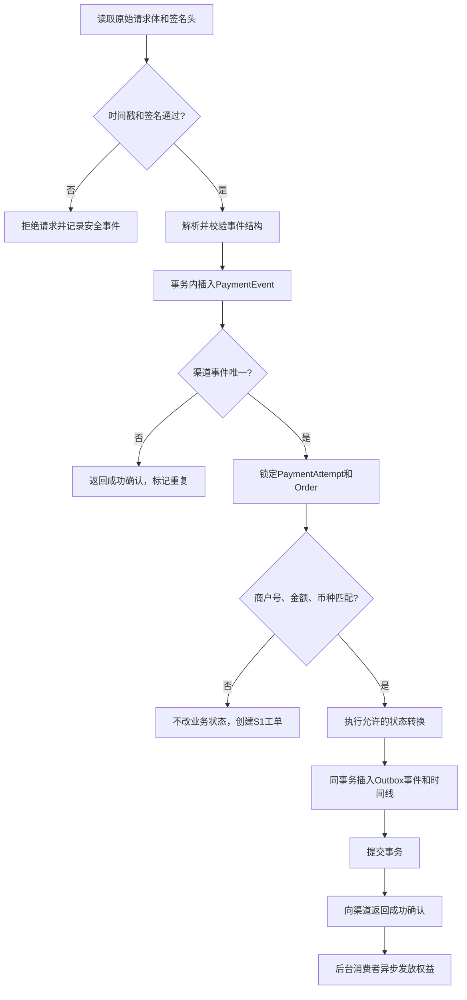
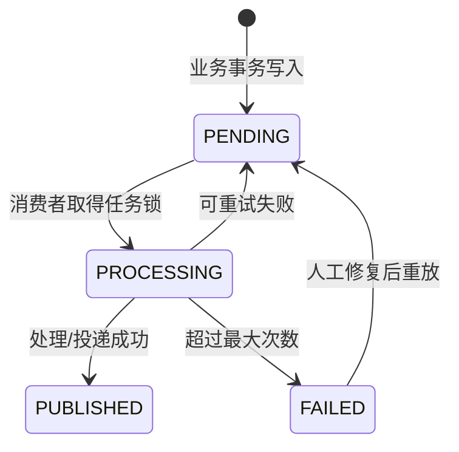

# Webhook、幂等与补偿机制

版本：V1.0  
状态：阶段 2 研发契约  
最后更新：2026-07-30

## 1. 文档目的

解释和约束支付结果从外部渠道进入系统后，如何做到可信、不丢、不重复、可恢复。

核心结论：分布式系统无法简单承诺“消息只投递一次”。本项目采用：

```text
至少一次投递
+ 事件去重
+ 状态条件更新
+ 业务幂等
+ Outbox可靠事件
+ 补偿任务与人工工单
= 业务效果只发生一次且可恢复
```

## 2. Webhook 与客户端返回的职责

| 信号 | 用途 | 是否可作为支付最终事实 |
|---|---|---|
| 客户端支付 SDK 返回 | 改善页面反馈，触发结果查询 | 否 |
| 支付渠道 Webhook | 渠道主动通知服务端 | 验签和核对通过后可以 |
| 服务端主动查单 | 在超时、冲突和迟到场景确认结果 | 可以 |
| 对账单 | 日后发现系统与渠道差异 | 可以作为复核依据 |

客户端可以被关闭、断网或篡改，因此不能直接把订单改为支付成功。

## 3. 模拟渠道签名协议

真实微信、支付宝、Stripe、Adyen 各有自己的签名协议。本项目只实现本地 `MOCKPAY` 协议，但保留渠道适配器边界。

### 3.1 请求头

```http
X-MockPay-Event-Id: evt_123
X-MockPay-Timestamp: 1785400000
X-MockPay-Signature: v1=<hex_hmac_sha256>
```

### 3.2 待签名内容

```text
{timestamp}.{raw_request_body}
```

签名：

```text
hex(HMAC-SHA256(webhook_secret, signed_payload))
```

### 3.3 验签规则

1. 必须读取未经 JSON 重新序列化的原始请求体。
2. 时间戳与服务器时间差默认不得超过 300 秒，防止旧请求重放。
3. 使用常量时间比较签名，避免时序攻击。
4. 支持当前密钥和上一版本密钥的短期轮换窗口。
5. 验签失败只能记录脱敏安全事件，不能更新支付或订单状态。
6. 即使签名有效，仍必须核对商户支付单号、商户号、金额、币种和渠道状态。

## 4. Webhook 处理流水线



### 4.1 为什么先验签再解析业务

未验签的内容不可信。可以读取和受控保存原始字节，但不能基于其中的订单号、金额或状态执行查询和更新。

### 4.2 为什么先插入支付事件

`UNIQUE(provider, provider_event_id)` 是传输层去重门。唯一冲突说明事件已经接收过，应返回渠道成功确认，避免渠道继续重试。

### 4.3 为什么权益不在 Webhook 请求中同步发放

- 渠道要求快速确认，权益服务可能耗时或失败。
- 同步调用会出现支付已更新但权益超时、渠道继续重试等复杂局面。
- 支付状态更新和 Outbox 事件同事务，权益由异步消费者可靠处理。

## 5. 四层幂等保护

| 层级 | 业务问题 | 幂等键/约束 | 重复时行为 |
|---|---|---|---|
| API 请求层 | 用户重复点击或网络重试 | `scope + Idempotency-Key` | 返回首次创建的业务资源 |
| 渠道事件层 | Webhook 重复投递 | `provider + provider_event_id` | 标记重复并返回渠道成功 |
| 状态转换层 | Webhook 与主动查单并发 | 条件更新 `WHERE status IN (...)` | 只有一个请求成功转换 |
| 业务副作用层 | 事件重复消费 | 发放/回收业务幂等键唯一 | 返回首次权益结果，不重复增减 |

只做渠道事件去重仍不够：主动查单可能没有相同事件号，也会触发支付成功。因此权益层必须再次幂等。

API 请求层的键持久化到 `idempotency_records.idempotency_key`，并与 `scope` 和请求摘要共同校验。

## 6. 条件状态更新

支付成功不是无条件 `UPDATE`，而是类似：

```sql
UPDATE payment_attempts
SET status = 'SUCCEEDED', provider_trade_no = ?, provider_paid_at = ?
WHERE id = ? AND status IN ('CREATED', 'PROCESSING');
```

受影响行数为 0 时：

- 如果当前已经 `SUCCEEDED`，按幂等成功处理。
- 如果当前 `FAILED/CLOSED`，进入冲突处理或迟到支付补偿。
- 不能直接覆盖未知状态。

MVP 使用数据库事务和条件更新；后续高并发环境可增加行锁或更严格的版本控制。

## 7. Outbox 可靠事件

### 7.1 解决的问题

以下顺序会丢事件：

```text
数据库提交支付成功
-> 进程崩溃
-> 尚未通知权益服务
```

因此支付状态更新和 `outbox_events(payment.succeeded)` 插入必须处于同一事务。

### 7.2 生命周期



### 7.3 消费规则

- 消费者领取任务时记录 `locked_at` 和执行者，避免多个实例同时处理。
- 锁超过租期可被其他消费者接管。
- 消费成功后再标记 `PUBLISHED`。
- 消费者本身必须按业务幂等键处理，因此任务重复领取也安全。
- 超过阈值创建异常工单，不能静默停在 `FAILED`。

## 8. 权益发放补偿

### 8.1 幂等键

```text
GRANT:{order_item_id}:{entitlement_definition_id}
```

### 8.2 事务步骤

1. 查询该幂等键的权益流水。
2. 若已成功，返回已有结果。
3. 锁定或条件更新用户权益。
4. 按会员/额度叠加规则计算新值。
5. 写入权益流水和当前权益。
6. 检查该订单全部必发权益是否生效。
7. 满足条件时把订单从 `PAID` 更新为 `FULFILLED`。
8. 写入时间线。

任一步失败整体回滚，任务按异常矩阵重试。不得通过创建第二个随机幂等键实现“补发”。

## 9. 退款与权益回收补偿

退款与回收是两个独立事实：

```text
渠道退款成功事务
-> Refund.SUCCEEDED
-> Order.REFUNDED
-> Outbox entitlement.revoke.requested

权益回收事务
-> UserEntitlement.REVOKED 或 REVOKE_FAILED
-> Refund.entitlement_action_status 更新
```

退款成功而回收失败时，用户不需要重新申请退款；系统继续自动/人工回收权益。

回收幂等键：

```text
REVOKE:{refund_id}:{user_entitlement_id}
```

## 10. 并发场景处理

| 并发场景 | 风险 | 处理策略 |
|---|---|---|
| Webhook 与主动查单同时确认成功 | 两次推进支付、两次发权益 | 支付条件更新 + 权益业务幂等 |
| 两个不同成功 Webhook 同时到达 | 重复履约 | 渠道事件唯一约束 + 支付状态条件更新 |
| 创建支付请求网络重试 | 创建多个渠道支付单 | 创建支付幂等记录 + 稳定商户支付单号 |
| 用户连续点击退款 | 重复退款 | 退款幂等键 + 可退金额事务校验 |
| 自动重试和人工补发同时执行 | 重复权益 | 同一发放幂等键 + 权益行锁/版本 |
| 额度消费和退款回收同时执行 | 负余额或超用 | `REVOKING` 先限制消费 + 版本条件更新 |
| 订单到期任务与支付成功同时执行 | 关单后已扣款 | 关闭前查单 + 条件更新 + 迟到支付规则 |

## 11. 重试与任务锁

### 11.1 任务领取

消费者通过一次原子更新领取可执行任务：

```text
status = PENDING
AND next_run_at <= now
AND (locked_at IS NULL OR locked_at < lock_expired_at)
```

领取后写 `RUNNING`、`locked_at` 和执行者 ID。

### 11.2 失败分类

| 失败类型 | 是否重试 | 示例 |
|---|---|---|
| 临时依赖故障 | 是 | 网络超时、数据库锁冲突 |
| 业务前置不满足 | 通常否 | SKU 无效、订单不可退款 |
| 数据不一致 | 停止自动处理 | 金额不一致、对象无法关联 |
| 安全风险 | 否并告警 | 验签失败、Scope 越权 |
| 未知内部错误 | 有限重试后转人工 | 未分类异常 |

重试前必须判断错误类型，不能对所有错误无限重试。

## 12. 异常工单与人工接管

达到以下条件创建或升级 `ExceptionCase`：

- 支付结果未知超过产品阈值。
- 可靠事件或权益任务超过最大重试次数。
- 金额、币种、商户号或状态冲突。
- 退款成功但权益回收持续失败。
- 出现批量同类异常或安全风险。

自动重试期间工单状态为 `RETRYING`；超过阈值后进入 `WAITING_MANUAL`。人工操作调用正式补偿 API，仍使用原幂等键，并记录操作者、原因、前后状态和关联 ID。禁止通过数据库客户端直接改状态。

## 13. Webhook 响应策略

| 场景 | 本地模拟响应 | 是否改变业务状态 |
|---|---|---|
| 验签通过且首次处理成功 | `200 accepted=true` | 是 |
| 验签通过且重复事件 | `200 accepted=true` | 否，幂等忽略 |
| 验签失败 | `401 accepted=false` | 否 |
| 结构不合法 | `400 accepted=false` | 否 |
| 金额/商户不一致 | `422 accepted=false` | 否，创建异常工单 |
| 内部临时失败且未持久化 | `503 accepted=false` | 否，允许渠道重试 |
| 事件已持久化但后续异步失败 | `200 accepted=true` | 支付事务按结果；内部自行补偿 |

真实渠道可能要求固定成功文案或特定状态码，由 Provider 适配器转换，业务层仍遵守相同原则。

## 14. 伪代码示例

```typescript
async function handlePaymentWebhook(rawBody, headers) {
  verifyTimestamp(headers.timestamp);
  verifySignature(rawBody, headers.signature);
  const event = parseAndValidate(rawBody);

  return database.transaction(async (tx) => {
    const inserted = await tx.paymentEvent.insertIfAbsent({
      provider: "MOCKPAY",
      providerEventId: headers.eventId,
      rawPayloadRedacted: redact(event),
    });

    if (!inserted) return { accepted: true, duplicate: true };

    const payment = await tx.paymentAttempt.findByMerchantTradeNo(
      event.merchantTradeNo,
    );
    assertPaymentMatches(payment, event);

    const changed = await tx.paymentAttempt.markSucceededIfProcessing(
      payment.id,
      event,
    );

    if (changed) {
      await tx.order.markPaid(payment.orderId);
      await tx.outbox.add("payment.succeeded", { paymentId: payment.id });
    }

    await tx.trace.add("payment.webhook.processed", payment.orderId);
    return { accepted: true, duplicate: !changed };
  });
}
```

伪代码用于解释职责，不是最终代码。实际实现还需处理迟到成功、冲突状态、错误映射和异常工单。

## 15. 安全要求

- Webhook Secret 通过环境变量或密钥系统提供，不进入仓库。
- 原始请求体大小受限，防止内存和日志攻击。
- 验签失败事件限量保存并脱敏，防止攻击载荷污染后台。
- 签名比较使用常量时间函数。
- 时间戳过期、事件号缺失和不支持的算法均拒绝。
- 密钥轮换记录版本，不在观察台显示任何可用密钥。
- 模拟器只在开发环境启用，并与普通用户权限隔离。

## 16. 验收用例

| 编号 | 场景 | 预期结果 |
|---|---|---|
| `AT-REL-01` | 相同创建订单幂等键并发 10 次 | 只有一个订单，其他返回相同资源 |
| `AT-REL-02` | 相同 Webhook 并发 10 次 | 一个事件生效，一次权益发放 |
| `AT-REL-03` | Webhook 与主动查单同时成功 | 支付、订单和权益各只变化一次 |
| `AT-REL-04` | 支付事务提交后模拟进程崩溃 | Outbox 恢复后仍发放权益 |
| `AT-REL-05` | 权益消费者处理后未标记 Outbox 成功就崩溃 | 重放时幂等返回，不重复权益 |
| `AT-REL-06` | 自动重试与人工补发同时执行 | 只有一个发放成功 |
| `AT-REL-07` | 使用错误签名、旧时间戳和篡改载荷 | 全部拒绝且业务状态不变 |
| `AT-REL-08` | 相同幂等键提交不同请求体 | 返回 409 冲突 |
| `AT-REL-09` | 退款请求超时后重复提交 | 只存在一个渠道退款请求 |
| `AT-REL-10` | 退款成功后回收任务连续失败 | 退款保持成功，任务转异常工单 |
| `AT-REL-11` | 任务锁持有进程崩溃 | 锁过期后其他消费者可以接管 |
| `AT-REL-12` | 金额差 1 分的正确签名事件 | 不更新支付，创建 S1 工单 |

## 17. 产品经理需要掌握的沟通点

1. “接口超时”只表示没有及时收到响应，不等于渠道没有执行。
2. “事件去重”与“业务幂等”不是同一层保护，两者都需要。
3. 支付状态和权益发放不要放在一个长事务或一个同步请求里。
4. Outbox 解决数据库提交与后续事件之间的丢失窗口。
5. 至少一次投递意味着消费者必须允许重复执行。
6. 重试必须区分临时错误、业务拒绝、数据不一致和安全风险。
7. 自动补偿失败后必须有可操作的人工闭环，而不只是错误日志。

## 18. 面试中的 30 秒讲法

> 支付渠道的 Webhook 可能重复、延迟或乱序，主动查单也可能与回调同时发生，所以不能依赖“消息只来一次”。我会做四层保护：API 幂等键防重复创建，渠道事件号防重复通知，条件状态更新防并发覆盖，权益业务幂等键防重复履约。支付成功和 Outbox 事件在同一事务里，保证钱已收后权益任务不会丢；消费者按至少一次执行，但重复消费不会重复发权益。超过重试阈值再进入异常工单和人工补偿。

## 19. 下一步

继续编写《登录认证与开放平台安全契约》，明确授权码、PKCE、state、账号映射、Token 生命周期、Scope 和密钥管理。
