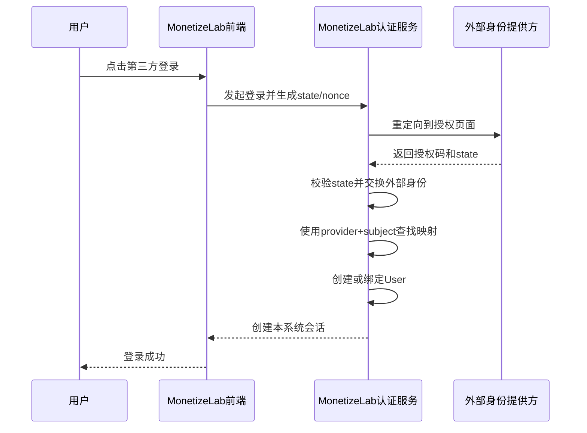
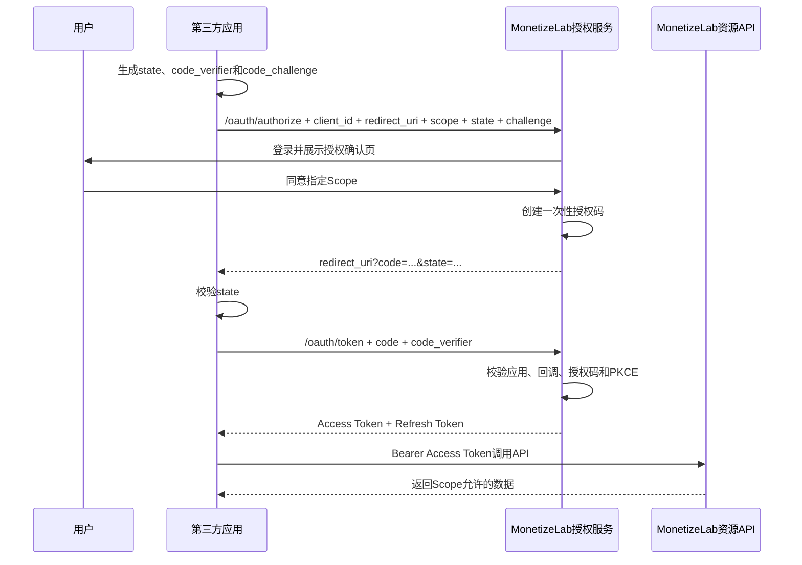
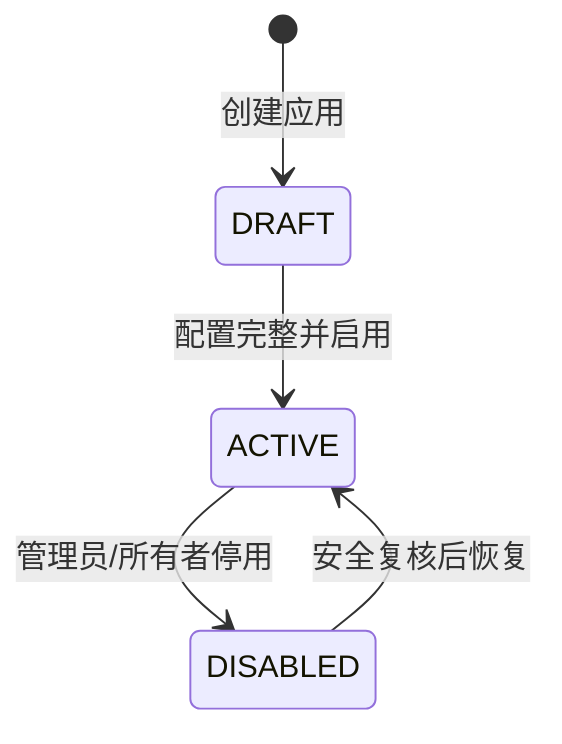

# 登录认证与开放平台安全契约

版本：V1.0  
状态：阶段 2 研发契约  
最后更新：2026-07-30

## 1. 文档目的

定义用户登录、第三方身份绑定、开放平台应用授权和 API 鉴权的产品与研发边界。

本项目涉及两个方向，必须分开理解：

1. **外部身份登录 MonetizeLab**：用户使用模拟微信、Google 等身份登录本系统，落到 `ExternalIdentity -> User` 映射。
2. **第三方应用接入 MonetizeLab 开放平台**：合作方应用通过 OAuth 2.0 授权码流程获得用户授权，用 Access Token 调用本系统 API。

前者解决“你是谁”，后者解决“这个应用被允许代表你做什么”。

## 2. 核心概念

| 概念 | 解决的问题 | 本项目对象 |
|---|---|---|
| Authentication 认证 | 当前访问者是谁 | `User`、`ExternalIdentity`、`UserSession` |
| Authorization 授权 | 已认证主体能做什么 | Role、Scope、`OAuthGrant` |
| Open Platform App | 哪个第三方系统申请接入 | `OpenPlatformApp` |
| Authorization Code | 短时、一次性的 Token 交换凭证 | `oauth_authorization_codes` |
| Access Token | 调用 API 的短期凭证 | `AccessToken` |
| Refresh Token | 无需用户再次登录即可换取新 Access Token | `AccessToken.refresh_token_hash` |
| Scope | 用户授予应用的最小权限范围 | `OAuthGrant.scopes` |

## 3. 外部身份登录流程

### 3.1 映射规则

- `provider + provider_subject` 是外部身份唯一键。
- 已存在映射时登录原用户，不根据昵称或邮箱猜测合并。
- 不存在映射且当前未登录时，创建新用户和绑定记录。
- 当前已登录用户主动绑定时，需要再次验证当前会话和外部身份。
- 外部身份已绑定其他用户时，不自动覆盖，进入账号申诉/合并流程。
- 解绑保留历史映射状态，避免审计链丢失。

### 3.2 账号合并边界

账号合并涉及订单、权益、订阅和退款归属，MVP 不自动执行。后台只能创建审核工单，后续产品规则决定：

- 哪个用户作为主账号。
- 同类会员是否叠加、取最大值或保留来源。
- 额度、订单、退款和订阅如何迁移。
- 原账号是否冻结以及如何回滚。

## 4. 开放平台授权码 + PKCE 流程

### 4.1 授权请求参数

| 参数 | 必填 | 规则 |
|---|---|---|
| `response_type` | 是 | 仅支持 `code` |
| `client_id` | 是 | 应用状态必须为 `ACTIVE` |
| `redirect_uri` | 是 | 与应用白名单精确匹配 |
| `scope` | 是 | 必须是应用允许范围的子集 |
| `state` | 是 | 由客户端生成并在回调时验证 |
| `code_challenge` | 是 | 从 `code_verifier` 推导 |
| `code_challenge_method` | 是 | 只允许 `S256` |
| `nonce` | OIDC 时是 | 防止 ID Token 重放 |

### 4.2 为什么需要 PKCE

授权码可能通过浏览器历史、系统日志或恶意应用被截获。PKCE 要求换 Token 时同时提供只有原客户端持有的 `code_verifier`，截获授权码的一方无法单独兑换。

### 4.3 为什么需要 state

`state` 绑定“谁发起了这次登录/授权”与“谁收到回调”，用于抵御登录 CSRF 和回调串单。它由客户端保存并校验，不能只由授权服务器原样回传后就视为安全。

## 5. Scope 设计

MVP-B 只提供只读 Scope，降低授权风险：

| Scope | 能力 | 授权页文案 |
|---|---|---|
| `profile.read` | 读取用户 ID、展示名和头像摘要 | 查看你的基本资料 |
| `orders.read` | 读取用户自己的订单摘要 | 查看你的订单记录 |
| `entitlements.read` | 读取当前会员与额度 | 查看你的会员和可用额度 |

默认不提供支付、退款、人工补发、商品配置等写 Scope。后台管理权限使用独立 RBAC，不通过普通开放平台 Token 获得。

Scope 校验执行两次：

1. 授权时，申请 Scope 不得超过应用 `allowed_scopes`。
2. API 调用时，Token Scope 必须包含接口要求的 Scope。

## 6. 凭证生命周期

| 凭证 | 建议生命周期 | 存储 | 失效条件 |
|---|---|---|---|
| 用户会话 | 演示 8 小时 | 只存 Token 摘要 | 退出、用户冻结、过期 |
| 授权码 | 5 分钟、一次性 | `code_hash` | 使用、过期、应用停用 |
| Access Token | 1 小时 | `token_hash` | 过期、撤销、授权/应用停用 |
| Refresh Token | 30 天并轮换 | `refresh_token_hash` | 使用后轮换、撤销、重用检测 |
| Client Secret | 无固定时间，支持轮换 | `client_secret_hash` | 应用停用或人工轮换 |

这些是项目基线，不代表真实公司必须采用相同期限；生产值应由安全、体验和业务风险共同确定。

### 6.1 Refresh Token 轮换

- 每次刷新成功签发新的 Refresh Token，并让旧 Token 失效。
- 已失效旧 Token 再次使用，视为可能泄漏，撤销该授权下全部 Token 并记录安全事件。
- 刷新后的 Scope 不得扩大。

## 7. 会话与浏览器安全

生产参考：

- 浏览器会话优先使用 `Secure + HttpOnly + SameSite=Lax/Strict` Cookie。
- 修改数据的 Cookie 会话请求需要 CSRF 防护。
- 登录成功后轮换会话 ID，防止会话固定攻击。
- 退出登录撤销服务端会话，不只清理前端缓存。
- 用户冻结、密码/密钥安全事件可撤销全部会话。
- 本地开发允许 Bearer 演示 Token，但不能把该模式表述为生产安全方案。

## 8. 开放平台应用生命周期

### 8.1 创建与启用

- 创建者只能管理自己的应用，管理员可以全局查看和停用。
- 启用前至少配置一个有效回调地址和一个允许 Scope。
- Client Secret 明文只在创建/轮换成功响应中展示一次。

### 8.2 停用与密钥轮换

- 应用停用后不签发新 Token，并撤销或拒绝现有 Token。
- 密钥轮换可设置短暂双密钥窗口，但后台只显示版本和创建时间，不显示明文。
- 疑似泄漏时立即撤销旧密钥和相关 Token，不使用宽限窗口。

## 9. 授权确认页产品要求

授权页必须明确显示：

- 第三方应用名称和经过审核的基础信息。
- 申请的每一项权限及用户可理解说明。
- “同意授权”和“取消”两个清晰操作。
- 已经授权过的 Scope 和本次新增 Scope。
- 授权有效性、撤销入口和隐私说明入口。

不得使用预勾选、模糊文案或把拒绝按钮隐藏在不明显位置。

## 10. RBAC 与 Scope 的区别

| 机制 | 使用位置 | 示例 |
|---|---|---|
| RBAC 角色权限 | 公司内部管理后台 | 客服可查单，财务可对账，运营可配置商品 |
| OAuth Scope | 外部应用代表用户访问 API | 合作方读取用户订单摘要 |
| 资源归属校验 | 所有用户数据接口 | 当前用户只能看自己的订单 |

有角色或 Scope 仍不代表可以访问任意对象，资源归属校验始终需要执行。

用户资源接口必须在服务端校验 `resource.user_id == current_user.id`；后台跨用户访问则校验角色权限并记录审计。

## 11. 认证错误码与用户反馈

| 错误码 | 场景 | HTTP | 用户/开发者动作 |
|---|---|---|---|
| `OAUTH_INVALID_CLIENT` | client_id 或密钥无效 | 401 | 检查应用配置 |
| `OAUTH_REDIRECT_URI_MISMATCH` | 回调地址不匹配 | 400 | 使用已登记地址 |
| `OAUTH_STATE_MISMATCH` | state 校验失败 | 400 | 重新发起登录，不重试旧回调 |
| `OAUTH_CODE_REUSED` | 授权码重复兑换 | 400 | 重新授权；记录安全事件 |
| `OAUTH_PKCE_FAILED` | verifier 不匹配 | 400 | 检查客户端 PKCE 实现 |
| `OAUTH_SCOPE_EXCEEDED` | 请求权限超出范围 | 403 | 缩小 Scope 或申请平台审核 |
| `OAUTH_TOKEN_EXPIRED` | Token 过期 | 401 | 使用合法 Refresh Token 刷新 |
| `OAUTH_TOKEN_REVOKED` | Token 已撤销 | 401 | 重新授权 |
| `EXTERNAL_IDENTITY_CONFLICT` | 身份已绑定其他用户 | 409 | 进入账号申诉/合并流程 |
| `USER_FROZEN` | 用户被冻结 | 403 | 联系客服，不创建新交易 |

用户侧文案不展示“subject、client secret、nonce”等技术细节；开发者控制台可以提供关联 ID 和配置指引。

## 12. 威胁与控制矩阵

| 风险 | 控制措施 |
|---|---|
| 登录 CSRF | `state`、同站 Cookie、会话绑定 |
| 授权码截获 | PKCE S256、短时一次性授权码、回调精确匹配 |
| Token 泄漏 | 只存摘要、短期 Access Token、Refresh Token 轮换和撤销 |
| Scope 越权 | 授权时和调用时双重校验、资源归属校验 |
| Client Secret 泄漏 | 明文只展示一次、摘要存储、轮换和调用异常告警 |
| 账号错误合并 | provider+subject 唯一，不按邮箱/昵称自动合并 |
| 重放攻击 | 授权码一次性、nonce、Refresh Token 重用检测 |
| 开放重定向 | redirect URI 精确白名单，不允许模糊前缀匹配 |
| 后台越权 | RBAC、二次确认、原因必填、审计 |

## 13. 审计与隐私

必须记录：

- 登录成功/失败、外部身份绑定/解绑。
- 应用创建、启用、停用和密钥轮换。
- 用户同意、拒绝和撤销授权。
- Token 签发、刷新、撤销和异常重用。
- Scope 越权、state/PKCE 失败和回调地址不匹配。

不得记录：

- Client Secret 明文。
- Access/Refresh Token 明文。
- 授权码明文。
- 完整手机号、邮箱或第三方原始资料。

## 14. 验收用例

| 编号 | 场景 | 预期结果 |
|---|---|---|
| `AT-AUTH-01` | 正常外部身份首次登录 | 创建用户和唯一外部身份映射 |
| `AT-AUTH-02` | 同一外部身份再次登录 | 返回原用户，不创建重复用户 |
| `AT-AUTH-03` | 已绑定身份尝试绑定另一用户 | 返回 409，原映射不变 |
| `AT-AUTH-04` | 正常授权码 + PKCE 流程 | 签发受限 Scope Token |
| `AT-AUTH-05` | 修改 state | 拒绝登录/授权，不创建会话 |
| `AT-AUTH-06` | 错误 code_verifier | Token 端点拒绝请求 |
| `AT-AUTH-07` | 同一授权码并发兑换两次 | 只有一次成功，另一次返回重复使用 |
| `AT-AUTH-08` | redirect URI 仅路径不同 | 仍然拒绝，必须精确匹配 |
| `AT-AUTH-09` | 使用不包含 `orders.read` 的 Token 查订单 | 返回 403 并记录审计 |
| `AT-AUTH-10` | 撤销授权后继续调用 | 旧 Token 立即失败 |
| `AT-AUTH-11` | Refresh Token 正常轮换 | 新 Token 生效，旧 Refresh Token 失效 |
| `AT-AUTH-12` | 再次使用旧 Refresh Token | 撤销授权下全部 Token 并告警 |
| `AT-AUTH-13` | 轮换 Client Secret | 新密钥有效，旧密钥按策略失效 |
| `AT-AUTH-14` | 停用应用 | 不签发新 Token，现有 Token 被拒绝 |
| `AT-AUTH-15` | 查询审计日志 | 敏感凭证均未出现明文 |

## 15. 实现边界

- 本项目用于理解协议和产品规则，不宣称自行实现了完整生产级 OAuth/OIDC 服务。
- 代码阶段优先采用经过验证的 OAuth/JWT/密码学库，不手写加密算法。
- 模拟第三方身份提供方只在本地运行，明确显示“演示环境”。
- 对真实微信、Google 或 Apple 登录，只提供适配点和产品差异说明，不在无凭证情况下伪造真实接入。

## 16. 产品经理需要掌握的沟通点

1. 登录认证和开放平台授权是两个方向，不能混成“接个登录 API”。
2. 外部身份的稳定唯一键是 provider + subject，不是昵称或可能变化的邮箱。
3. `state` 保护请求关联和 CSRF，PKCE 保护授权码被截获后的兑换。
4. Access Token 短期使用，Refresh Token 轮换并检测重用。
5. Scope 只控制能力范围，资源归属校验仍然必须执行。
6. 回调地址需要精确白名单，Client Secret 和 Token 只存摘要。
7. 账号合并会影响订单、权益和订阅，不能自动覆盖映射。

## 17. 面试中的 30 秒讲法

> 开放平台这里我会先区分两个方向：用户拿微信或 Google 身份登录我们，核心是外部 subject 到内部 user 的唯一映射；第三方应用接入我们，则走 OAuth 授权码加 PKCE。授权时校验 client、精确回调地址、state 和 Scope，换 Token 时验证一次性授权码和 code_verifier。Access Token 短期，Refresh Token 轮换并检测重用，密钥和 Token 只存摘要。即使有 Scope，接口仍要校验资源归属，避免应用读取其他用户的数据。

## 18. 下一步

编写《测试策略与需求追踪矩阵》，把 PRD、业务规则、状态转换、异常场景、接口和自动化测试建立一一对应关系。
