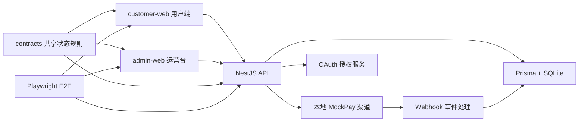

# 代码学习地图与本地运行

版本：V1.0  
状态：可运行 MVP  
最后更新：2026-07-30

## 1. 先明确学习目标

本项目不是要求产品经理学会从零写一套支付系统，而是训练三种研发沟通能力：

1. 能把 PRD 规则定位到接口、数据表、事务和测试。
2. 能解释“为什么这样建模”，而不只复述页面流程。
3. 出现异常时，能用业务编号、对象状态和事件时间线与研发一起定位。

推荐阅读方式：先跑通页面，再沿一次真实订单向下追代码。不要从第一行开始顺序背代码。

## 2. 本地运行

### 2.1 环境

- Node.js 22 或更高版本。
- pnpm 11 或更高版本。
- 首次执行端到端测试时需要 `pnpm exec playwright install chromium`。
- SQLite 数据库位于 `apps/api/prisma/dev.db`，不需要单独安装数据库服务。

### 2.2 首次初始化

```powershell
pnpm install
pnpm db:generate
pnpm db:push
pnpm db:seed
```

### 2.3 启动与访问

```powershell
pnpm dev
```

| 服务 | 地址 | 用途 |
|---|---|---|
| 用户端 | `http://127.0.0.1:5175` | 商品、购买、支付场景、订单和权益 |
| 运营台 | `http://127.0.0.1:5174` | 指标、交易链路、异常补发和 OAuth 实验台 |
| API | `http://127.0.0.1:3000/api/v1` | 前后端分离接口 |
| Swagger | `http://127.0.0.1:3000/docs` | 研发联调接口列表 |

端口 `5175` 是明确配置，不是默认 `5173`，因为当前机器的 `5173` 已被其他项目使用。

### 2.4 验证与重置

```powershell
pnpm typecheck     # 全工作区严格 TypeScript 检查
pnpm test          # 共享领域规则单测
pnpm build         # API 与两个前端生产构建
pnpm test:e2e      # 桌面和移动端业务/视觉验收
pnpm db:seed       # 完整重建基础演示数据
```

用户端“重置演示”只清空交易数据，保留商品、用户和开放平台应用；`pnpm db:seed` 会完整重建本地数据。

## 3. 系统结构



## 4. 目录职责

| 路径 | 负责什么 | 产品经理应该看什么 |
|---|---|---|
| `apps/customer-web/src/main.tsx` | 用户购买和组合状态体验 | 页面如何避免把权益失败说成支付失败 |
| `apps/customer-web/src/api.ts` | 用户端调用 API | 前端提交哪些业务参数，哪些金额不由前端提交 |
| `apps/admin-web/src/main.tsx` | 交易观察、补偿、OAuth 演示 | 客服需要哪些编号、状态和人工入口 |
| `apps/api/src/business.controller.ts` | 交易 API 路由 | 调用者、动作与资源命名 |
| `apps/api/src/business.service.ts` | 订单、支付、权益、退款核心实现 | 状态更新顺序、事务边界、幂等和补偿 |
| `apps/api/src/auth.controller.ts` | OAuth API 路由 | authorize、token、userinfo、revoke 四个端点 |
| `apps/api/src/auth.service.ts` | OAuth/PKCE 安全实现 | 回调白名单、Scope、一次性授权码和 Token 哈希 |
| `apps/api/prisma/schema.prisma` | 数据表、关系、索引和唯一约束 | 20 个对象如何连接，哪些规则由数据库兜底 |
| `apps/api/prisma/seed.ts` | 演示用户、商品、权益规则和应用 | 可重复演示的基础数据 |
| `packages/contracts/src/index.ts` | 共享状态与用户展示映射 | 三套状态如何组合成用户能理解的文案 |
| `tests/e2e/smoke.spec.ts` | 业务验收 | 产品验收条件如何转成自动化动作和断言 |

## 5. 从一笔订单开始读代码

按下面顺序，每一步都先在页面操作，再看对应函数：

| 步骤 | 页面动作 | API/函数 | 核心数据对象 |
|---|---|---|---|
| 1 | 选择商品 | `GET /demo/bootstrap` | Product、Sku、SkuEntitlementRule |
| 2 | 确认购买 | `BusinessService.createOrder` | Order、OrderItem、IdempotencyRecord |
| 3 | 创建支付 | `BusinessService.createPayment` | PaymentAttempt |
| 4 | 模拟渠道成功 | `BusinessService.completePayment` | PaymentEvent |
| 5 | 确认资金事实 | `BusinessService.confirmPayment` | PaymentAttempt=SUCCEEDED、Order=PAID、OutboxEvent |
| 6 | 发放权益 | `BusinessService.fulfillOrder` | UserEntitlement、ExceptionCase |
| 7 | 写权益流水 | `BusinessService.activateEntitlement` | EntitlementLedger |
| 8 | 完成订单 | `BusinessService.fulfillOrder` | Order=FULFILLED、TransactionTraceEvent |
| 9 | 查看链路 | `BusinessService.orderDetail` | 全部聚合对象与关联编号 |

## 6. 规则到代码的快速索引

| 产品规则 | 代码落点 | 验证证据 |
|---|---|---|
| 后端重算价格，不信前端金额 | `createOrder` 按 `sku.priceMinor` 写订单 | E2E 正常购买 |
| 订单保存权益快照 | `OrderItem.entitlementSnapshot` | 交易详情和数据库字段 |
| 创建订单幂等 | `IdempotencyRecord(scope, idempotencyKey)` 唯一约束 | 重复请求返回原订单 |
| 回调事件去重 | `PaymentEvent(provider, providerEventId)` 唯一约束 | 相同事件返回 `duplicate: true` |
| 资金成功与权益成功分离 | `confirmPayment` 与 `fulfillOrder` 两段执行 | 权益失败时 `PAID/GRANT_FAILED` |
| 权益发放幂等 | `EntitlementLedger.idempotencyKey` 唯一约束 | 人工补发复用 `GRANT:明细:权益定义` |
| 人工操作留痕 | `ExceptionCase` + `TransactionTraceEvent` | 运营台时间线 |
| 授权码一次性 | `OAuthAuthorizationCode.status/usedAt` 条件更新 | 重放换 Token 返回 401 |
| Token 不存明文 | `AccessToken.tokenHash` | OAuth 页面与数据模型 |

## 7. 排查问题时先找哪几个编号

1. `orderNo`：业务主线入口，用户和客服最常提供。
2. `merchantTradeNo`：我方支付尝试编号，用于与渠道请求对齐。
3. `providerTradeNo`：渠道资金流水号，用于查单和对账。
4. `providerEventId`：Webhook 去重依据。
5. `correlationId`：一次内部处理链路的日志关联号。
6. `UserEntitlement.id`：权益异常和人工补发的目标对象。
7. `refundNo`：退款进度与权益回收的关联入口。

## 8. 三轮学习建议

第一轮只讲业务：不看代码，用状态机解释正常支付与权益失败。  
第二轮讲接口和数据：能指出请求、对象、唯一键和事务边界。  
第三轮讲异常：任选金额不一致、重复回调、权益失败、授权码重放，说明检测、阻断、补偿和用户文案。

