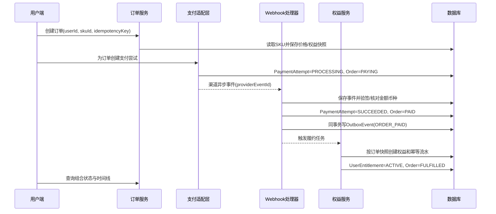
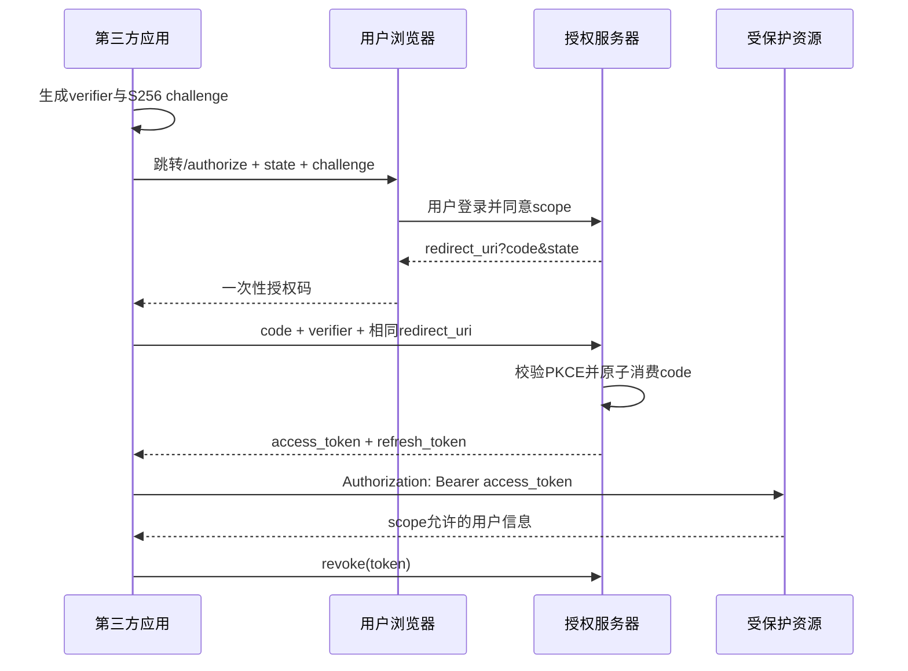

# 支付与认证代码逐层解读

版本：V1.0  
状态：代码学习材料  
最后更新：2026-07-30

## 1. 支付成功到权益到账，底层到底做了什么



### 1.1 为什么先有业务订单，再有支付尝试

订单回答“用户买了什么、应该付多少钱、应该获得什么”；支付尝试回答“这一次通过哪个渠道付款、渠道结果是什么”。一次订单可以在支付失败后创建新的支付尝试，因此两者不能合成一张表。

代码位置：`BusinessService.createOrder` 与 `BusinessService.createPayment`。

### 1.2 为什么金额用整数分

`1900` 表示人民币 19 元。整数避免浮点精度问题，且便于与渠道金额精确比对。币种单独保存为 `CNY`，不能只存数字。

代码位置：`Sku.priceMinor`、`Order.payableAmountMinor`、`PaymentAttempt.amountMinor`。

### 1.3 为什么要保存订单快照

用户下单后，商品可能改名、改价或修改权益。历史订单必须仍能回答当时承诺了什么，因此 `OrderItem` 保存 SKU 名称、价格、币种和权益 JSON 快照。履约从快照读取，不临时读取当前 SKU 配置。

代码位置：`createOrder` 中的 `entitlementSnapshot`，`fulfillOrder` 中的 `JSON.parse(item.entitlementSnapshot)`。

### 1.4 Webhook 为什么先落事件再改状态

先保存 `PaymentEvent` 才能审计“渠道发过什么”；唯一键 `provider + providerEventId` 先挡住重放。验签、商户、金额、币种和订单关联任何一项失败，都只能把事件标为拒绝，不能把支付改成成功。

本地模拟器没有真实渠道密钥，但保留了同样的处理边界。金额不一致会生成 `PAYMENT_AMOUNT_MISMATCH` S1 异常。

### 1.5 资金事务和权益事务为什么分开

`confirmPayment` 先提交不可逆的资金事实：支付成功、订单已支付、Outbox 事件已写入。`fulfillOrder` 再执行权益。

如果把两者放在一个数据库事务里，权益代码报错会回滚支付成功记录，系统可能误以为用户没有付钱。正确结果是：

```text
Order=PAID
PaymentAttempt=SUCCEEDED
UserEntitlement=GRANT_FAILED
ExceptionCase=DETECTED
```

用户端必须显示“支付成功，权益到账延迟”，不能显示“支付失败”或再次出现付款按钮。

### 1.6 Outbox 解决什么问题

仅仅“先改订单，再发消息”有一个窗口：数据库提交成功，但进程在发消息前崩溃，权益任务永远丢失。Outbox 把“订单已支付事件”与订单状态放进同一数据库事务，后台任务稍后可靠投递。

本 Demo 为便于单进程演示，会紧接着执行履约并把 Outbox 标为已发布；生产环境应由独立 worker 拉取。

### 1.7 三层幂等

| 层次 | 幂等键 | 防止什么 |
|---|---|---|
| 创建业务订单 | `scope + idempotencyKey` | 用户连点或网络重试生成多个订单 |
| 渠道回调 | `provider + providerEventId` | 重复 Webhook 重复更新状态 |
| 权益流水 | `GRANT:orderItemId:definitionId` | 重复任务或人工补发多发权益 |

幂等不是“代码里先查一下”这么简单，必须有数据库唯一约束兜住并发请求。

## 2. 异常补偿怎么实现

### 2.1 自动补偿与人工接管

权益失败时创建 `ExceptionCase`，记录异常码、严重等级、重试次数、下次重试时间和来源权益 ID。生产方案是最多自动重试 4 次，仍失败才转 S2 人工；Demo 为展示效率允许运营台直接人工补发。

人工补发调用 `retryException`：

1. 校验异常类型确实支持权益补发。
2. 找到原订单权益快照，而不是读取新规则。
3. 复用原权益对象和原发放幂等键。
4. 权益变为 ACTIVE，订单变为 FULFILLED。
5. 异常变为 RESOLVED，记录操作者与原因。

### 2.2 退款为什么也拆资金和权益

退款成功意味着资金事实已经改变，权益回收失败不能把退款状态改回失败。两种状态必须分别展示。Demo 正常退款会写 `Refund=SUCCEEDED`、`entitlementActionStatus=SUCCEEDED`、权益 REVOKED 和负向流水。

## 3. 第三方登录与开放平台授权不是一回事

| 机制 | 主体关系 | 解决的问题 | 核心对象 |
|---|---|---|---|
| 第三方登录 | 外部身份 ↔ 本系统用户 | “这个人是谁” | ExternalIdentity、UserSession |
| 开放平台 OAuth | 用户允许第三方应用访问本系统 | “这个应用能代表用户做什么” | OpenPlatformApp、OAuthGrant、AuthorizationCode、AccessToken |

把两者混为“第三方登录接口”会遗漏 Scope、回调白名单、用户授权、Token 生命周期和撤销能力。

## 4. OAuth 授权码 + PKCE 的实现步骤



### 4.1 `state`

第三方应用在授权前生成随机 `state`，回调时必须与本地保存值一致，用于防止登录 CSRF。授权服务器负责原样返回，不替客户端判断是否一致。

### 4.2 PKCE

客户端生成高熵 `code_verifier`，授权请求只发送其 SHA-256 结果 `code_challenge`。换 Token 时提交原 verifier。即使授权码在浏览器或系统跳转中泄露，没有 verifier 也不能换 Token。

### 4.3 回调白名单

`redirect_uri` 必须与应用登记值精确匹配，不能只比较域名或前缀，否则攻击者可能构造相似路径窃取授权码。

### 4.4 授权码一次性

数据库只存授权码 SHA-256 哈希。换 Token 时通过条件更新把 `ACTIVE` 原子改为 `USED`；同一 code 第二次使用返回 401，并发重放也只能成功一次。

### 4.5 Scope 与 Token

请求的 Scope 必须是应用允许范围的子集。Access Token 和 Refresh Token 只在签发时返回明文，数据库保存哈希；刷新时轮换旧 Token，撤销后立即拒绝访问。

代码位置：`AuthService.authorize`、`AuthService.token`、`AuthService.refresh`、`AuthService.userInfo`、`AuthService.revoke`。

## 5. 与研发评审时应该问什么

### 支付

- 哪个对象代表用户购买意图，哪个对象代表一次渠道尝试？
- 金额、币种、商户号和订单关联在哪里核对？
- 渠道重复或乱序通知由什么数据库约束兜底？
- 数据库成功、消息发送失败时怎么恢复？
- 支付成功但权益失败，用户文案、客服入口和 SLA 是什么？
- 补发是否复用原快照和幂等键，操作原因是否审计？

### 认证与开放平台

- 外部身份的唯一键是什么，绑定冲突怎么处理？
- 回调地址是精确匹配还是前缀匹配？
- `state`、`nonce` 和 PKCE 分别由谁生成、保存和验证？
- 授权码如何保证一次性并抵抗并发重放？
- Token 明文是否落库，刷新是否轮换，撤销何时生效？
- API 如何验证 Scope，而不只验证“Token 有效”？

## 6. 当前 Demo 与生产系统的边界

- MockPay 不使用真实微信、支付宝、Stripe、Adyen 或 IAP SDK。
- Webhook 保留事件、核对与幂等边界，但没有真实渠道证书轮换。
- Outbox 在同进程内立即处理，生产应拆独立消息投递和 worker。
- OAuth 是教学实现，没有真实登录页、MFA、设备风控、密钥管理服务和完整审计中心。
- SQLite 适合本地演示；生产环境需要评估 PostgreSQL/MySQL、锁策略、分库和容灾。

